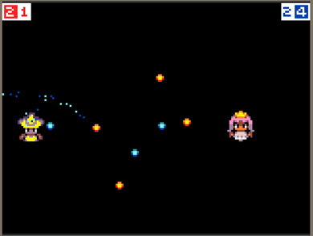
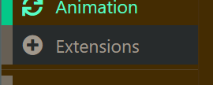
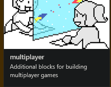

In this tutorial we will be making a game where a witch and fairy throws fireballs at eachother.

**Our Goal:** Build a game where two players control characters, shoot projectiles, score points when they hit the other player, and the first to 10 points wins!

---

**Let's Start Coding!**

**Step 1: Setting Up Your Project**

1.  Go to the MakeCode Arcade website (`arcade.makecode.com`).
2.  Click the big "**+ New Project**" button.
3.  Name your project (e.g., "Magic Duel Code") and click "**Create**".

You'll see:
* **Simulator:** Where your game runs (left).
* **Toolbox:** Where all the code blocks live (middle).
* **Workspace:** Where you build your code (right).

Notice the `on start` block already there?
* **Coding Concept: Events.** An "event" is something that happens in the game. The `on start` block is an **event handler** – it holds the code that runs *only once*, right when the game begins. It's like the starting whistle!

**Step 2: Adding Multiplayer Tools**

Our game needs two players, so we need special blocks.

1.  Look at the bottom of the toolbox and click "**Extensions**".

2.  Find and click the "**Multiplayer**" extension. Poof! New teal blocks appear in your toolbox.

* **Coding Concept: Libraries/Extensions.** Think of extensions like adding extra tools to your toolkit. They give you new blocks (new commands or instructions) that let your program do specific things, like handling two players at once.

