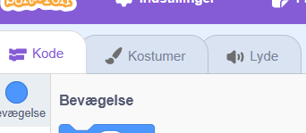
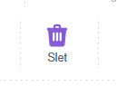
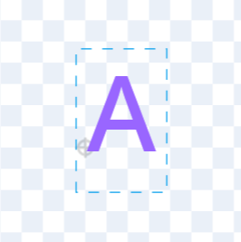
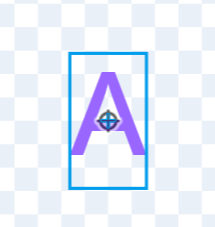
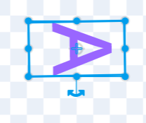

# 1. Lav et rumskib

Først skal vi starte på https://scratch.mit.edu/

Tryk på "Find på" i toppen

I stedet for katten skal vi lave et rumskib.

Så gå ind på "Kostumer" fanen øverst til højre

Slet katten ved at trykke på slet

Brug nu tekst værktøjet

Tryk i midten og skriv A

Du skal sikre dig at den er helt i midten

Sidst skal du rotere den så den peger mod højre. Det er vores fremad.

