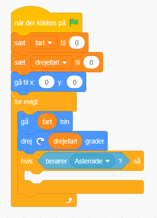
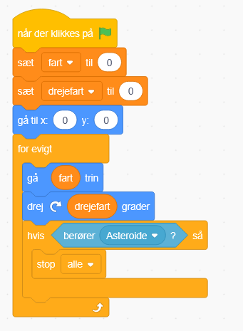

# 10. Tab når rører asteroide

Nu mangler vi at kunne tabe i spillet når vi bliver ramt af en asteroide

Så vi skal over i Rumskibets kode

Her indsætter vi en hvis blok

Som skal have en berører Asteroide

Og hvis det er sandt, så skal den aktivere den stop alle blokken

