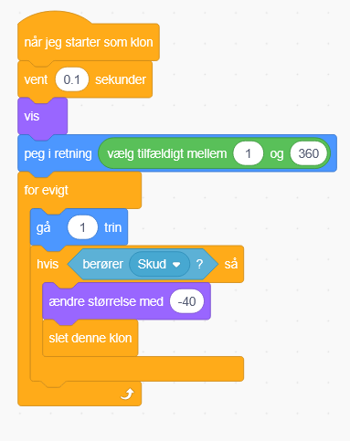
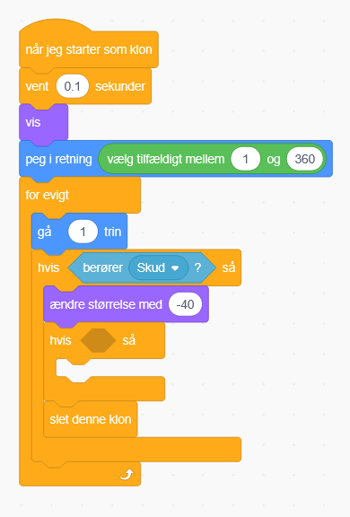
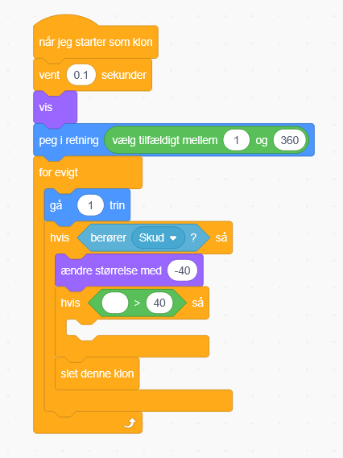
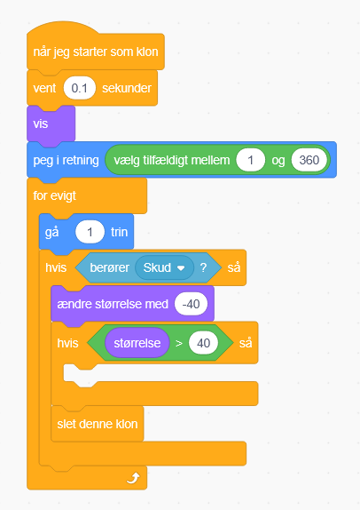
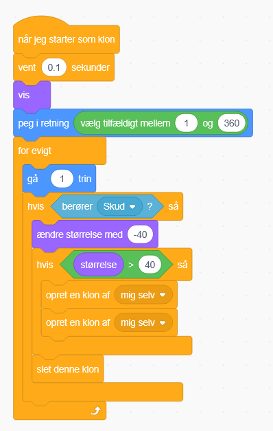

# Tilføjelse: Asteroide i stykker

I stedet for at asteroiderne går i stykker med det samme, kan de gå i stykker først i stedet.

Så gå ind på asteroidekoden

Her skal vi bruge en ændre størrelse blok fra udseende, og sætte de til minus 40, og sætte den under "hvis berører skud"

Så skal vi sætte en hvis blok ind imellem ændre størrelse og slet denne klon

Derefter skal du finde en "større end" blok under operatorer og sætte ind i hvis blokkens sekskant

Så under udseende kan du finde "størrelse" som angiver asteroidens nuværende størrelse.

Den sætter du ind til venstre, og så skriver du 40 til højre

Til sidst så indsætter du 2 opret en klon af mig selv inde i hvis blokken

Prøv at køre spillet og skyd nogle asteroider!
