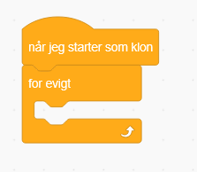
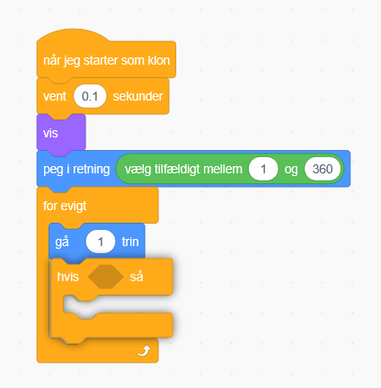
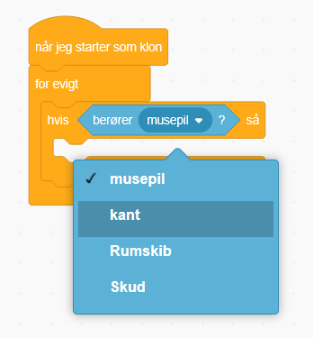
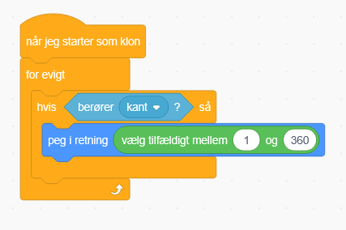
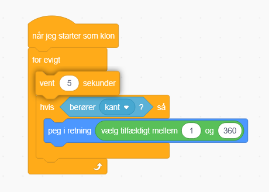

# Tilføjelse: Ny retning ved kant

Måske har du lagt mærke til at mange asteroide ligger i kanten og ikke kommer ud

Hvad med at vi laver noget kode der får dem til at skifte retning!

Under asteroider, lav en ny Når jeg starter som klon blok

Og så indsæt en for evigt blok

Derefter en hvis blok

Så skal vi have en berører kant blok

Så tag peg i retning og kopier din tidligere vælg tilfældig!

Til sidst så vent i 5 sekunder i toppen af for evigt blokken

Tjek nu om dine asteroide flyder bedre rundt!
