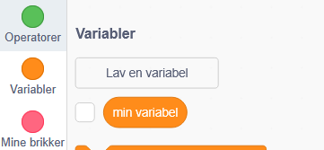
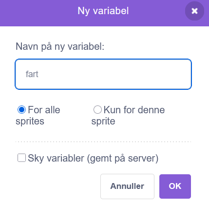
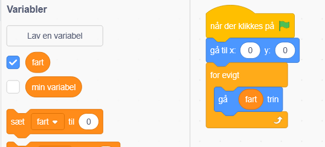
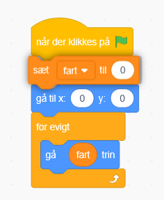
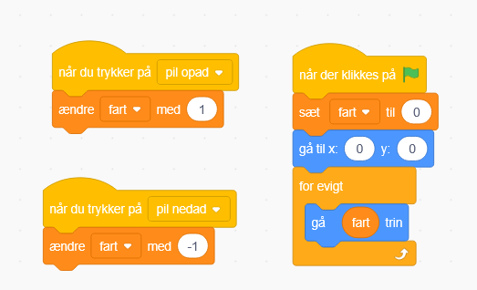

# 2. Flyv fremad

Nu skal vi tilbage til kode fanen for vores rumskib.

Find en "når der klikkes på start" blok, under Hændelser (gul), og sæt den ind i kodevinduet.

Derefter find en "gå trin" blok, under Bevægelse (blå), og sæt din ind under, så de klikker sammen.

Så find en "for evigt" blok, under Kontrol (orange), og sæt den rundt om, den blå blok

Hvis du starter spillet nu ved at trykke på det grønne flag så flyver dit skib fremad.

Lad os hellere kunne nulstille skibet når vi starter igen.

Så tag en "gå til x" blok, sæt den ind i toppen, og skriv 0 og 0 i de hvide felter.

Nu kan du se den flyve frem hver gang du trykker start.

Men vi vil gerne selv kunne indstille farten løbende i spillet.

Så vi går ind under Variabler og laver en ny variabel som vi giver navnet fart.

Derefter trækker vi den nye variabel "fart" ind i stedet for "10" i trin blokken

Så skal vi under Hændelser have fat i "når du trykker på mellemrum" blokken, og sætter den ind i kodevinduet.

Derefter skal vi ændre så det er pil opad i stedet for mellemrum der aktiverer blokken.

Så skal vi have fat i "ændre fart med 1" blokken under Variabler og sætter ind under pil opad blokken

Du kan nu sætte din fart op ved at trykke på pil op på tastaturet!

Vi skal så sørge for at vi nulstiller farten når spillet starter

Og til sidst skal vi også lige kunne sænke vores fart.

Det gør vi ved at kopiere eller gentage de blokke for at øge farten. Vi bruger bare pil nedad og -1.

Nu skulle dit rumskib kunne flyve frem og tilbage ved at trykke pil op og ned

Se alle blokke her:

