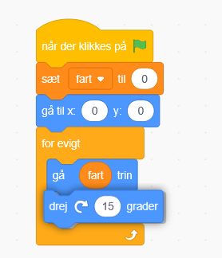
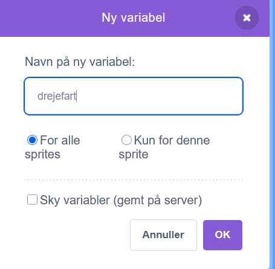
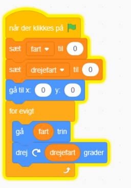
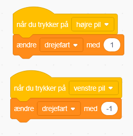
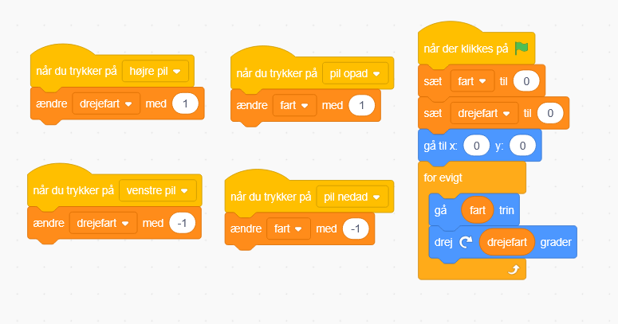

# 3. Drej rumskibet

Nu skal vi have rumskibet til også at kunne dreje

Under bevægelse findes der en drej blok, den sætter vi ind i bunden af vores for evigt løkke

Du kan nu se skibet dreje rundt hele tiden

Men vi også gerne kunne styre dette. Så vi skal have lavet en variabel mere, der skal hedde "drejefart"

Det skal vi så også nulstille, og bruge i stedet for tallet i dreje blokken

Så skal vi også lave nogle blokke til når vi trykker på højre og venstre pil, at vi så sætter drejefartvariablen op eller ned.

Prøv nu at flyve rundt ved forsigtigt at bruge piltasterne!

Alle dine blokke burde nu se sådan her ud

