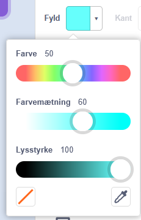
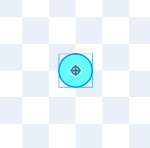
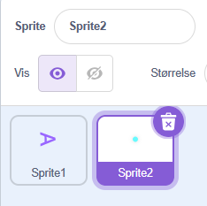
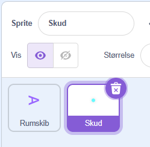

# 4. Tegn skud til rumskibet

Nu vil vi gerne lave skud til rumskibet. Først skal vi lige tegne et.

Så vi går kigger nederst til højre og klikker på kat ikonet og så Tegn for at lave et nyt sprite, som skal være vores skud

Zoom så ind ved at trykke nederst til højre på lup ikonet med +

Når vi har zoomet lidt ind, vælger vi vores pensel værktøj

Så vil vi gerne have en anden farve, jeg vælger en lyseblå farve i Fyld. Du kan også vælge pink.

Derefter trykker jeg ovenpå midter ikonet så jeg er sikker på at mit runde skud er i midten. Det er vigtigt når den skal bevæge sig.

Til sidst omdøber vi lige rumskibets og skuddets sprites. Så bliver det nemmere at læse.

Så vi ændrer navnet i "Sprite" feltet på begge

Så at de hedder Rumskib og Skud.

