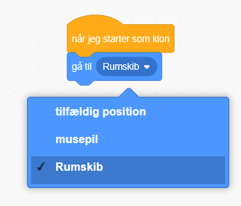
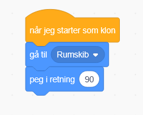
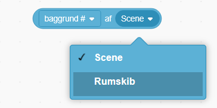
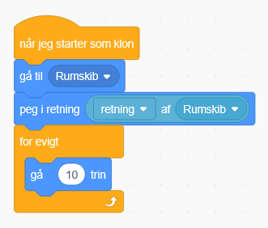
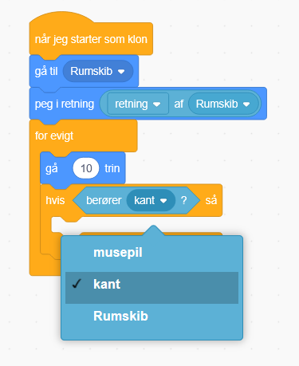
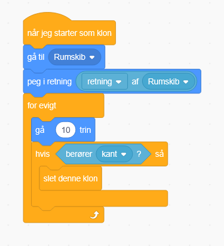
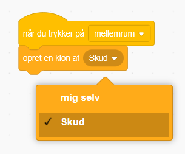
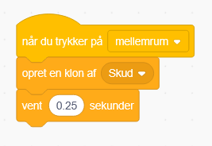
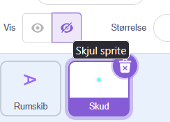
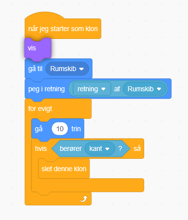

# 5. Skyd med rumskibet

Nu vil vi gerne gøre så skud bevæger sig

Så vi skal sikre os vi er på kode fanen for Skud

Her skal vi bruge "når jeg starter som klon" fra Kontrol (orange)

Så skal vi sætte skuddet til at starte ovenpå rumskibet.

Det gør vi ved at bruge "gå til (tilfældig position)" blokken, og sætte værdien til rumskib.

Så skal vi få den til at pege i samme retning som rumskibet så den kan flyve den vej

Så vi bruger "peg i retning" blokken, fra Bevægelse

Men vi skal også finde rumskibets retning. Det gør vi ved at finde "[baggrund] af (Scene)" blokken, og vælge rumskib i stedet for Scene

Derefter vælger vi retning i den anden boks, og sætter den ind i "peg i retning"

Så skal vi bruge en for evigt og gå 10 trin  blok og sætte under

Nu skal vi indsætte en "hvis blok" fra kontrol så vi kan gøre noget ved skud der ryger ud af banen

Vi skal så finde en 6 kantet blok i registrering der hedder "berører (musepil)" og indsætte den i hvis blokken.

Den skal så have værdien "kant", så den aktiver hvis blokken når den rører kanten

Så skal vi finde "slet denne klon" og indsætte den i midten af hvis blokken

For at oprette disse kloner skal vi gå over på rumskib.

Det er vigtigt du går over på rumskibet og sætter koden på den!

Her bruger vi en "når du trykker på mellemrum" blok, og så skal vi finde "opret en klon af (mig selv), men ændre det til skud

For at bestemme hvor hurtigt den skyder, indsætter vi så en "vent (1) sekunder" blok, og ændrer værdien

Prøve at skyde for at se om det virker!

Til sidst kan du skjule den orignale skud ved at trykke på Skud sprite og skjul visningen

Og finde vis blok, så vi viser klonen, ved at indsætte det under "når jeg starter som klon".

Prøv at skyde med dit rumskib og test om det stadig virker.
