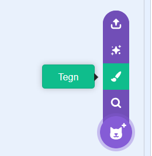
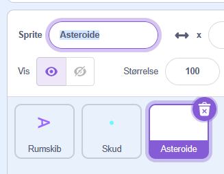
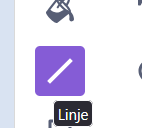
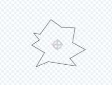
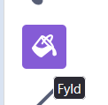
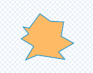

# 6. Tegn asteroide

Nu skal vi lave vores asteroider

Først skal vi tegne en. Det gør vi ved at klikke på tegn ny sprite

Omdøb den gerne lige til Asteroide

Så vælger vi linje værktøjet

Så laver vi en form med takker. Du må selv bestemme hvordan din asteroide ser ud.

Så vælger vi Fyld værktøjet

Vælg eventuelt en fyldefarve og tryk i midten af formen for at fylde farven.

Så har du en asteroide vi kan kode i næste trin
