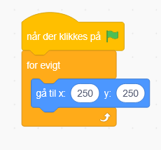
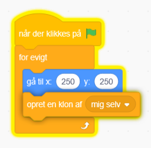
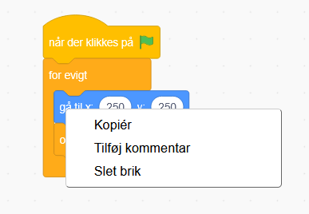
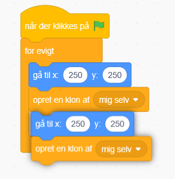
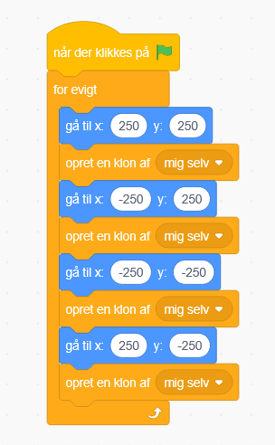
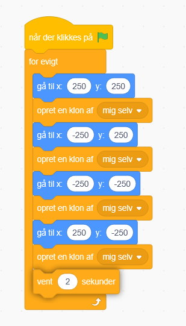

# 7. Opret mange asteroider

Vi vil gerne have at mange asteroider "spawner" i spillet

Start med at åbne kodefanen på asteroiden, og find en når der klikkes på start blok.

Så skal vi finde en for evigt blok og sætte ind

Derefter en gå til blok, og skriv 250 og 250 for at den skal flytte sig til øverste højre hjørne

Så skal vi bruge opret en klon af mig selv blokken

Så vil vi gentage det her 3 gange mere, brug evt. højreklik og kopier

og sæt ind igen

gentag så vi har det 4 gange. Og skriv forskellige X og Y værdier ligesom på billeder.

250, 250 er øverst til højre

-250, 250 er øverst til venstre

-250, -250 er nederst til venstre

250, -250 er nederst til højre

Til sidste vil vi have en vent 1 sekund, imellem hver gang vi skal vente imellem af oprette asteroider. Sæt det til 2 eller mere.

Tjek om du nu får oprettet asteroide i hver hjørne!
