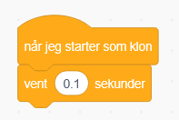
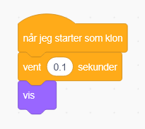
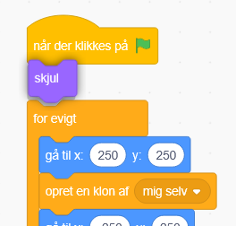
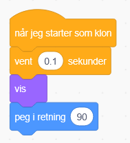
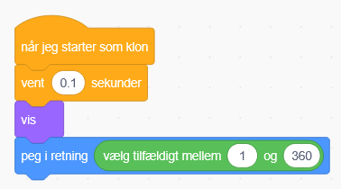
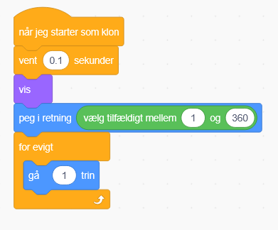
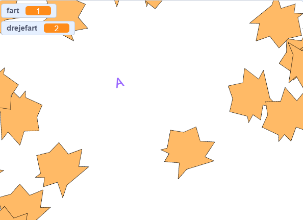

# 8. Bevæg asteroiderne

Nu skal vi have asteroiderne til at bevæge sig.

Ved siden af vores "når der klikkes på" kæmpe blok, så laver vi en når jeg starter som klon blok.

Så vil vi gerne have den venter når den starter, i 0.1 sekunder

Derefter vil vi gerne sørge for at den er vist.

På samme tid vil vi lige skjule den originale på start

Så vil vi gerne have at den peger en tilfældig retning, så start med en peg i retning blok

Og så indsæt en vælg et tilfældig tal, og sæt det mellem 1 og 360

Så skal den også gå fremad ved at bruge for evigt med gå 1 trin blokkene

Test nu om spillet virker ved at asteroider flyver rundt!

