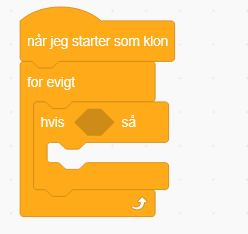
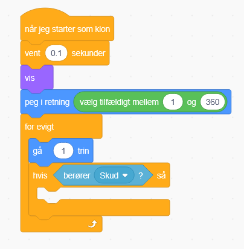
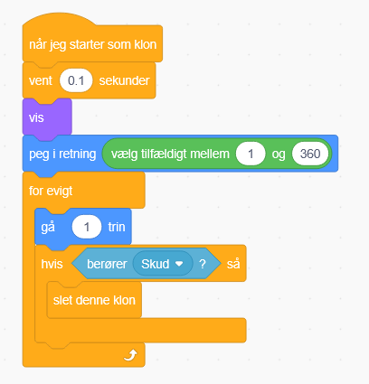

# 9. Skud rammer asteroide

Så vil vi gerne kunne smadre asteroiderne ved at ramme dem med skud.

Det gør vi ved at indsætte en hvis blok i bunden af for evigt på asteroidens klon blokke

Derefter finder vi en berører (musepil) blok, sætter den til Skud, og indsætter i hvis blokkens 6 kantshul

Til sidst indsætter vi en slet denne klon

Prøv nu at skyde asteroiderne og se om de forsvinder!
