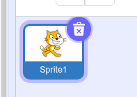
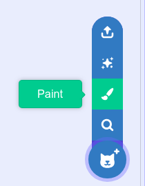
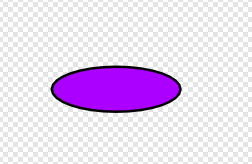
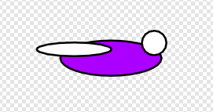
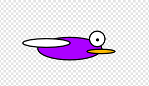
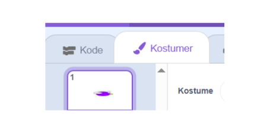

# Tegn en Flappybird

Vi laver et nyt projekt og starter med at slette katten.

Derefter trykker vi på Paint/Tegn knappen.

Så er vi kommet ind i tegnemode for en ny sprite, hvor vi så vælger cirkel værktøjet.

Man kan vælge en anden farve ved at trykke på Fyld og trække i sliders

En flappybird består faktisk bare af en masser cirkler så begynd med at tegne dens krop ved at lave en aflang lilla cirkel.

Så laver vi en hvid cirkel for dens vinge og en hvid cirkel for dens øje

Brug penselværktøjet til at lave en prik i øjet.

Lav en orange cirkel til næbet.

Læg mærke til at vi er på kostumer siden,  kode kan man lave ved at trykke på den anden fane.

