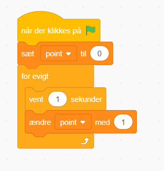

# Tilføjelse: Point

Vi vil gerne finde ud af hvem der er bedst. Så vi må hellere finde en måde at tælle hvor mange point man får.

Du skal lave en ny variabel der hedder "point", og så skal du sætte blokke ind så vi ændrer den hver sekund:

Men kan du måske i stedet, som en udfording, lave f.eks. et æble sprite der ændrer i vores point når vi rører dem? Og som derefter nulstiles tilbage til højre side? Tænk på det ligesom et rør der bevæger sig mod venstre og nulstiller hvis den rammer spilleren.
