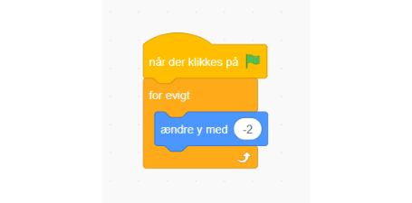
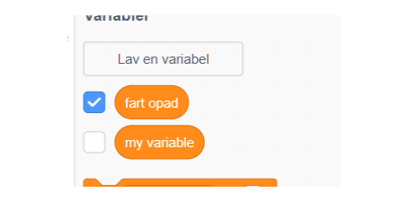
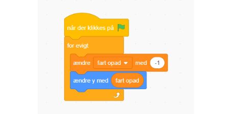
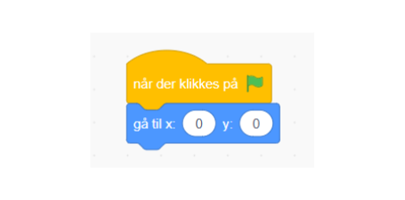
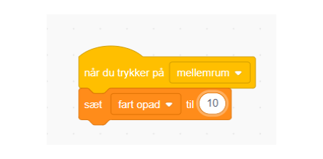
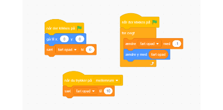

# Tyngdekraft og Hop

Ved at trække blokke ind på kodesiden kan vi lave tyngdekraft.
Hiv "når der klikkes på" ind til at starte en ny sekvens af kode. Denne sekvens får ansvaret for vores tyngdekraft opførsel.
I sekvensen bruger vi en "forever" og en "change y by " blok til at få vores sprite til at falde nedaf.

For at få rigtig tyngdekraft skal vi accelerere mod jorden, det gør vi ved at have en variabler der bestemmer farten mod jorden.
Lav en ny variabel ved at trykke på "Lav en variable", og kald den opadhastighed.

I vores bloksekvens, hiv en variabel blok ind i "for evigt", så opadhastigheden bliver større i hver gennemgang af forever loopen. Derefter ændrer vi y med opadhastigheden.

Så virker vores tyngdekraft!

Men for at vores figur går tilbage til start skal vi lave en ny bloksekvens.
Hiv en ny "når der klikkes på" ind, og så hiv en "gå til x,  y" ind og sæt det til 0,0. Det nulstiller vores position.

Nulstil også vores variabel til 0

Så laver vi en tredje bloksekvens hvor det er mellemrum tasten der starter koden.
Vi sætter vores opadhastighed til 10 hvilket betyder vores figur går opad.

Vores kode skulle nu se sådan ud

