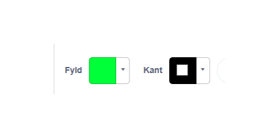
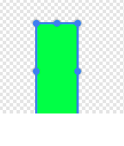
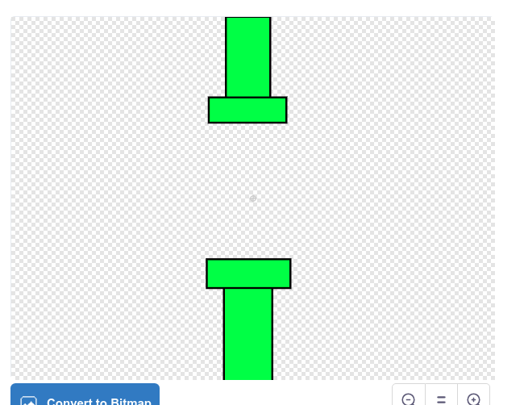
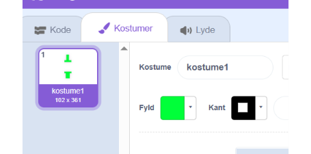

# Tegn en forhindring

Tryk på ny sprite og tryk på tegn/paint

Vælg en grøn farve og en sort kant

Forhindringer i Flappybird er egentlig bare nogle firkanter der ligner rør. Brug firkant værktøjet.

Tegn nogle flere firkanter så du har en forhindring.

Du kan gå ud af tegnemode/kostumemode ved at trykke på kode fanen

