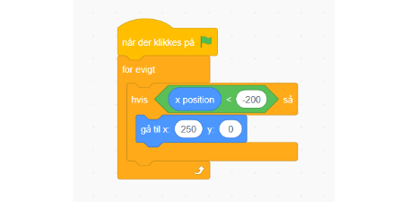
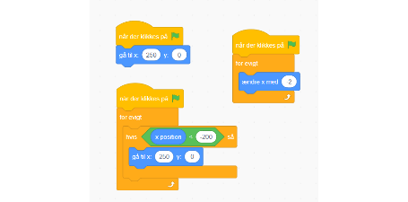

# Flyt forhindring

Først laver vi en bloksekvens der får vores forhindring til at starte i højre side (x position 250 eller lignende)

Så laver vi en anden bloksekvens der bevæger vores forhindring mod venstre (den negative x-retning)

Til sidst laver vi en bloksekvens der flytter vores forhindring tilbage til højre side af skærmen når den har ramt venstre side.

Vores kode skulle nu se sådan ud

