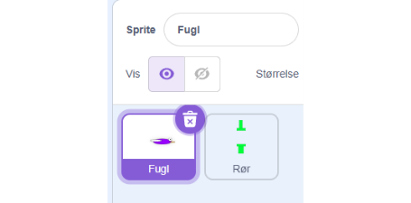
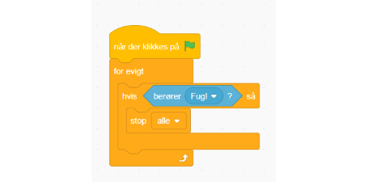
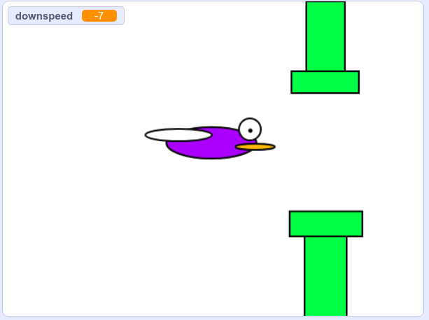

# Tab ved at ramme forhindring

Sørg for at vores sprites er navngivet så det giver mening. Du kan ændre navn ved at skrive i "Sprite" feltet.

Start en ny kodesekvens på forhindrings spriten!
Brug en "for evigt", en "hvis", og så brug "berører" og vælg pipe.
Hvis det er sandt, så "stop alle"

De basale elementer i flappybird er nu færdigt! og vi kan spille spillet.

