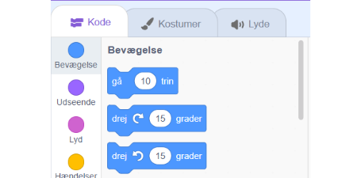
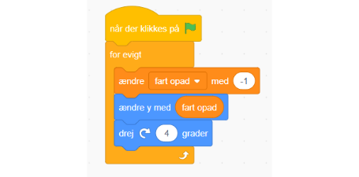
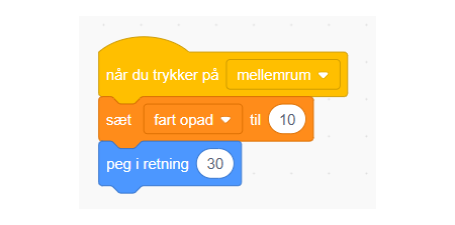
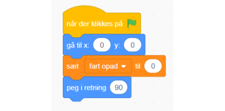

# Tilføjelse: Næbet svinger

For at gøre dit spil sværere kan vi tilføje at næbet svinger. Så det drejer mod jorden når vi ikke trykker mellemrum.

Gå ind under bevægelse og find drej

Derefter tag drej blokken og smid den ind i for evigt løkken så den hele tiden drejer mod uret. Tjek hvad der sker i spillet!

Vi vil så gerne have at den vender snuden op igen. Så tag en "peg i retning" og tryk på tallet og vælg en lidt opadgående retning.

Vi skal også nulstille vores retning når vi starter spillet!

Din kode burde se sådan ud for fuglen!

