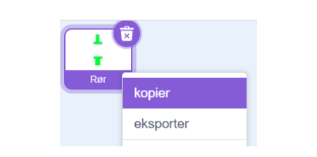
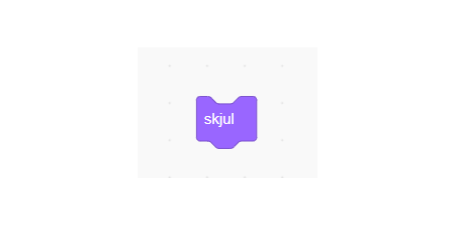
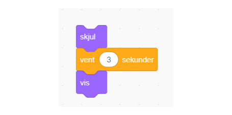

# Udfordring: Flere rør

Nu tænker vi måske det er på tide at få flere rør som man skal igennem, så det er kortere imellem dem.

Vi skal simpelthen have flere rør, så vi må hellere kopiere vores rør sprite.

Derefter skal vi skjule og "pause" en af vores rør i lidt tid, for derefter at vise det igen. Så den kommer lidt forskudt.

Så først skal vi finde "skjul" i "Udseende"

Derefter skal vi bruge en  "vent sekunder" blok

Og så skal vi vise spriten igen

De 3 blokke kan vi sætte sammen

Nu er udfordingen til dig at finde ud af hvor du skal sætte de 3 blokke.

Husk at vi skal stoppe den i at bevæge sig mod venstre.
