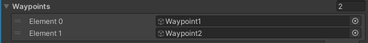
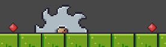
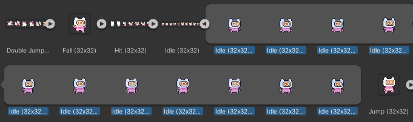
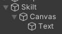
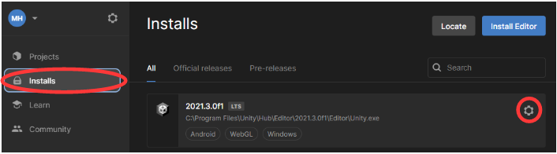
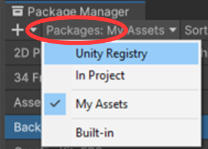

*Af: Michael Hansen, Coding Pirates Furesø, 2022-23, version 1.52*

*Dokument og kode ligger her: <https://github.com/mhfalken/unity/>*


Dette er en guide i hvordan man laver et lille 2D platform spil i Unity,
som vist på billedet. Det inkluderer alt fra en start pakke og til en
fuld gennemgang i hvordan man gør.

Der er ingen specifik C# undervisning, men det meste af den kode som man
skal bruge er vist med eksempler. På min github ligger den fulde
”løsning” som en pakket fil

<https://github.com/mhfalken/unity/blob/main/2dplatform_final.zip>

Der er også en liste af tips, hvis man allerede kender lidt til Unity.

Dokumenter indeholder også i bunden nogle links til gode videoer.

Dokumentet og koden er lavet i Unity version 2020.3. Den burde også
virker i andre versioner, men der kan være små forskelle. (Dokumentet er
opdateret til også at passe til 2021.3).

[1 C# editor mini guide (Visual Studio)
[4](#c-editor-mabcini-guide-visual-studio)](#c-editor-mabcini-guide-visual-studio)

[2 2D Platformspil [5](#d-platformspil)](#d-platformspil)

[2.1 Tegn banen [5](#tegn-banen)](#tegn-banen)

[2.2 Tilføj player [5](#tilføj-player)](#tilføj-player)

[2.3 Flyt Player [6](#flyt-player)](#flyt-player)

[2.4 Hop Player [8](#hop-player)](#hop-player)

[2.5 Frugter [8](#frugter)](#frugter)

[2.6 Game tekst og point
[10](#game-tekst-og-point)](#game-tekst-og-point)

[2.7 Simple forhindringer
[11](#simple-forhindringer)](#simple-forhindringer)

[2.8 Bevægelige objekter
[12](#bevægelige-objekter)](#bevægelige-objekter)

[2.9 Lyd [13](#lyd)](#lyd)

[2.10 Udvid banen til en bredere skærm
[14](#udvid-banen-til-en-bredere-skærm)](#udvid-banen-til-en-bredere-skærm)

[2.11 Baggrundsbillede [14](#baggrundsbillede)](#baggrundsbillede)

[3 2D Platformspil - Avanceret funktioner
[14](#d-platformspil---avanceret-funktioner)](#d-platformspil---avanceret-funktioner)

[3.1 Tænd/slut forhindringer
[14](#tændslut-forhindringer)](#tændslut-forhindringer)

[3.2 Skud [15](#skud)](#skud)

[3.3 Fan booster [17](#fan-booster)](#fan-booster)

[3.4 Player animationer [17](#player-animationer)](#player-animationer)

[3.5 Tag frugt animation
[20](#tag-frugt-animation)](#tag-frugt-animation)

[3.6 Trampolin [21](#trampolin)](#trampolin)

[3.7 Flere baner [22](#flere-baner)](#flere-baner)

[3.8 Inspiration til videre forløb
[23](#inspiration-til-videre-forløb)](#inspiration-til-videre-forløb)

[4 Unity Reference [23](#unity-reference)](#unity-reference)

[4.1 Assets foldere [23](#assets-foldere)](#assets-foldere)

[4.2 Eksterne felter [24](#eksterne-felter)](#eksterne-felter)

[4.3 Komponenter [24](#komponenter)](#komponenter)

[4.4 Taster [25](#taster)](#taster)

[4.5 Bevægelse [25](#bevægelse)](#bevægelse)

[4.6 Kollision [26](#kollision)](#kollision)

[4.7 Animation [27](#animation)](#animation)

[4.8 Lyd [27](#lyd-1)](#lyd-1)

[4.9 Game tekst [28](#game-tekst)](#game-tekst)

[4.10 PreFabs [29](#prefabs-1)](#prefabs-1)

[4.11 Partikler [29](#partikler)](#partikler)

[4.12 Dynamisk opret og slet et objekt
[29](#dynamisk-opret-og-slet-et-objekt)](#dynamisk-opret-og-slet-et-objekt)

[4.13 Script kommunikation
[30](#script-kommunikation)](#script-kommunikation)

[5 Utility [30](#utility)](#utility)

[5.1 Tidshåndtering [30](#tidshåndtering)](#tidshåndtering)

[5.2 Fejlsøgning [31](#fejlsøgning)](#fejlsøgning)

[5.3 Interval check [31](#interval-check)](#interval-check)

[5.4 Forsinkelse [31](#forsinkelse)](#forsinkelse)

[5.5 Importer Unity pakke
[32](#importer-unity-pakke)](#importer-unity-pakke)

[6 Specielle scripts [32](#specielle-scripts)](#specielle-scripts)

[6.1 Bevægelige objekter
[32](#bevægelige-objekter-1)](#bevægelige-objekter-1)

[6.2 Stå fast på platforme som bevæger sig
[34](#stå-fast-på-platforme-som-bevæger-sig)](#stå-fast-på-platforme-som-bevæger-sig)

[7 Special setup [34](#special-setup)](#special-setup)

[7.1 Flyt kamera efter spiller
[34](#flyt-kamera-efter-spiller)](#flyt-kamera-efter-spiller)

[7.2 Glat overflade [35](#glat-overflade)](#glat-overflade)

[7.3 WEB release [35](#web-release)](#web-release)

[7.4 Android support (avanceret)
[36](#android-support-avanceret)](#android-support-avanceret)

[8 Links [38](#links)](#links)

# C# editor mabcini guide (Visual Studio)

Den C# editor (det program som man skriver sin C# kode i) hedder i det
følgende MVS. Det gælder også selvom man bruge Visual Studio Code, da de
ser ens ud.

Den kan en masse forskellige ting, hvor nogle få af dem er beskrevet
her.

MVS ”kommunikere” med Unity og kender dens syntaks. Den kan derfor
hjælpe en når man skriver sin kode.

- Hvis man starter med at skrive et navn på en funktion som den kender,
  så viser den løbende nogle forslag. Her kan man vælge fra en liste
  eller bare trykke på *Enter* hvis den ’rigtige’ allerede er valgt.

- Hvis man skal lave fx en for loop, så man kan skrive for og trykke på
  *TAB* tasten, så laver MVS automatisk en for loop skabelon. Dette
  virker for: for/while/if/foreach/switch. Det gør det lettere, hvis man
  ikke er helt sikker på syntaksen.

- Man kan få hjælp til en Unity funktion ved at holde musepilen over
  navnet.

- MVS farver alt afhængig af hvad det er, så kik på farverne for at se
  om det ser rigtigt ud.

- Hvis noget er understreget med rødt, så er det fordi MVS mener der er
  noget galt.

- Unity GUI ’ser’ ikke rettelsen før filen er gemt.

Gode genvejstaster: (CTRL = CMD på MAC)

| **Tast**   | **Funktion** |
|:-----------|:-------------|
| **CTRL-S** | Gem filen    |
| **CTRL-Z** | Undo         |
| **CTRL-C** | Kopier       |
| **CTRL-V** | Indsæt       |
| **CTRL-H** | Søg/erstat   |

Specielle MAC taster:

| **Tast**           | **Funktion** |
|:-------------------|:-------------|
| **OPTION-8**       | \[           |
| **OPTION-9**       | \]           |
| **SHIFT-OPTION-8** | {            |
| **SHIFT-OPTION-9** | }            |

# 2D Platformspil

Denne tutorial vil gennemgå hvordan man laver et 2D Platform spil – se
forsiden af dette dokument.

Generelt er al C# kode markeret med denne font, og alle referencer til
**Unity GUI’en markeret med denne font**. Lad os komme i gang.

1.  Åbent Unity HUB’en og opret et nyt projekt ved at trykke på **New
    Project** i øverste højre hjørne. Vælg **2D** og giv det et navn, fx
    **2dplatform_spil** og tryk **Create project**. Det tager lidt tid …
    Det program som kommer frem vil fremover blive kaldt **GUI’en**.

2.  Det først man skal gøre er at importere den start pakke vi skal
    bruge. Den ligger her:
    <https://github.com/mhfalken/unity/blob/main/2dplatform.unitypackage>
    Vælg download og gem filen et sted du kan finde igen.

3.  I GUI’en: **Assets-\>Import Package-\>Custom package** og vælg
    ovenstående fil. I det vindue som kommer frem trykkes på **Import**
    i nederst højre hjørne. Pakken er nu importeret og ligger under
    **Assets**.

4.  Vælg **Assets/Levels** og doblet tryk på **Level1**. Slet
    **Assets/Scenes** folderen.

Lige nu skal der i **Scene** vinduet gerne være 6 grønne felter.

## Tegn banen

Tegn en lille simpel bane med mindst en platform som man kan hoppe op på
(det skal ikke ligne min!). Man kan altid tegne videre senere…

1.  Tryk på *Terrain* i **Hierarchy**’et (under *Grid*) og derefter på
    **Open Tile Palette** i **Scene** vinduet.

Ved at vælge billederne i **Tile Palette** vinduet kan man tegne sin
bane i **Scene** vinduet. Man kan også slette, kopier mv. ved at vælge i
denne menu (øverst i **Tile Palette** vinduet).


2.  Tegn lidt på banen. Ikke for meget på nuværende tidspunkt, da man
    har brug for en Player for a kunne finde de rette dimensioner for
    hop mv.

Når man er færdig med at tegne, skal man i *Terrain* **Inspector**’en
sætte **Layer** tll *Ground*.

3.  Først skal *Ground* oprettes, det gøres ved at trykke på den lille
    pil ned i **Inspector**’en ud for **Layer** og vælge **Add Layer** i
    bunder af linsten. Skriv *Ground* ud for **User Layer 3**.

4.  Tryk på *Terrain* i **Hierarchy**’et igen og vælg nu *Ground* i
    **Inspector**’en.


## Tilføj player

Vi skal nu vælge den figur vi vil bruge som vores Player i spillet. Der
er 4 forskellige at vælge imellem og de ligger alle i folderen **Pixel
Adventures 1/Assets/Main Characters/**. Kik dem igennem og find den du
bedst kan lide.

1.  Vælg en figur type under **Main Characters**. Tryk på billedet af
    **idle** (1) versionens pil til højre (2).

2.  Tryk på det første billede (3) som kommer frem og træk det ind i
    **Scene**.


Det skal nu gerne se sådan ud.


Der kommer også et nyt objekt ind i **Hierarchy**’et som hedder noget
med ”Idle …”.

3.  Rename nu ’Idle …’ til *Player*. Husk stort P!

Man kan ændre størrelsen af figuren i **Inspector**’en ved at ændre
**Scale** værdierne.


Tryk på **Play** i toppen af
skærmen og se hvordan det ser ud. Der sker ingen ting, *Player* bliver
’flyvende’ i luften.

4.  Vælg *Player* i **Hierarchy**’et og i **Inspector**’en (ude til
    højre) tryk **Add Component** og vælg **Rigidbody 2D**.

Rigidbody komponenten gør, at *Player* bliver håndteret af fysikmotoren,
hvilket blandt andet vil sige at den bliver påvirket af tyngdekraften.

Tryk **Play** og se hvad der sker! Nu falder *Player* gennem platformen.
Det skyldes at den ikke har nogen Collider.

5.  I **Inspector**’en tilføj nu en **Box Collider 2D**

Tryk **Play** igen. Nu skal figuren gerne falde ned og stå på
platformen.

6.  Tilpas **Collider**’en så den bedre passer til størrelsen af figuren
    ved at trykke på **Edit Collider**
     og derefter tilpasse
    ’firkanten’ i **Scene**n.

7.  Man skal under **Rigidbody 2D** sætte følgende (ellers kan figuren
    vælte):


## Flyt Player

For at få *Player* til at flytte sig skal vi oprette vores første
script.

1.  I folderen **Assets/Scripts/** højreklik og opret et **Create-\>C#
    Script** og kald det *PlayerController*. (Det er vigtigt at gøre det
    i et flow – man må ikke rename filen …!)

2.  Træk nu dette script op over *Player* i **Hierarchy**’et.

3.  Dobbelt klik på scriptet for at åbne det i MVS editoren.

Koden her er skrevet i C# og det er meningen at man selv skal tilføje
den kode som mangler alt efter hvad man vil opnå.

Hvis man ønsker en gennemgang af C# er her en link til en god guide på
dansk, lavet specielt til Unity:
[https://github.com/Grailas/CodingPiratesAalborg/blob/master/Guides/Hj%C3%A6lpeguide.pdf](https://github.com/Grailas/CodingPiratesAalborg/blob/master/Guides/Hjælpeguide.pdf)

4.  Skriv følgende linjer i Update() funktionen (de nye linjer er vist
    med **fed**):

```csharp
void Update()
{
    float dir = Input.GetAxisRaw("Horizontal");
    Debug.Log(dir);
}
```

5.  Kik på **Console** vinduet og tryk på **Play**.

Tryk nu på *piletaskerne* og se hvad der sker. Debug linjen skriver ud
hver gang man trykker på en piletast. (Virker også med A og D). Det er
linjen Debug.Log() som printer ud på **Consolen** og er et vigtigt
redskab når man skal debugge sin kode.

6.  Ændre nu filen til følgende (det er meningen at man selv skal ændre
    filen så den matcher nedenstående):
    ```csharp
    public class PlayerController : MonoBehaviour
    {
        [SerializeField] float speed = 10;

        // Start is called before the first frame update
        void Start()
        {
        }

        // Update is called once per frame
        void Update()
        {
            float dir = Input.GetAxisRaw("Horizontal");
            transform.Translate(dir * speed * Time.deltaTime, 0, 0);
        }
    }
    ```

Tryk på **Play** og se om det virker.

7.  Man kan ændre hastigheden i **Inspector**’en ved at ændre på
    **Speed** værdien.


### Flip Player

Figuren skal nu kikke i den retning som den bevæger sig. Det gøres ved
at bruge **Flip** feltet i **Sprite Renderer**. Dette skal selvfølgelig
gøres automatisk fra *PlayerController* scriptet.

8.  Tilføj den manglende kode:
```csharp
public class PlayerController : MonoBehaviour
{
    [SerializeField] float speed = 10;
    SpriteRenderer sr;

    // Start is called before the first frame update
    void Start()
    {
        sr = GetComponent<SpriteRenderer>();
    }

    // Update is called once per frame
    void Update()
    {
        float dir = Input.GetAxisRaw("Horizontal");
        transform.Translate(dir * speed * Time.deltaTime, 0, 0);
        if (dir < 0)
            sr.flipX = true;
    }
}
```

Nu kan figuren vende til venstre men ikke tilbage igen til højre.

9.  Tilføj selv de to linjer kode som mangler for at *Player* også kan
    vende til højre igen.

## Hop Player

Vi skal nu have *Player* til at kunne hoppe og det gøres ved at tilføje
noget mere kode til *PlayerController* scriptet. Selve hoppet virker ved
at tilføje en kræft til **Rigidbody** komponenten:

```csharp
rb.AddForce(Vector3.up * jumpPower);
```

Ridigbody komponenten skal først ’hentes’ (ligesom SpriteRenderer blev
det) og dette gøres på følgende måde (de skal stå samme sted i koden som
for SpriteRenderer):

```csharp
Rigidbody2D rb;

...

rb = GetComponent<Rigidbody2D>();
```

jumpPower skal være en synlig variabel i **Inspector**’en, så man senere
kan rette i den:

```csharp
[SerializeField] float jumpPower = 200;
```

Jump tasten aflæses på følgende måde:

```csharp
bool jump = Input.GetButtonDown("Jump");
```

1.  Sæt nu alle de ovenstående linjerne ind de ”rigtige” steder i
    scriptet. Kik på scriptet for at se hvor de tilsvarende linjer står.

2.  Tilføj en if sætning for at udføre hoppet når man trykker på *Space*
    tasken.

3.  Juster hoppe højden i **Inspector**’en med værdien **Jump Power**.

Hvis man synes at *Player* kan hoppe lidt for langt, så kan man i
**Inspector**’en øge **Rigidbody 2D-\>Gravity Scale** værdien til fx
*1.5*, det vil så kræve at man samtidig øger **Jump Power** feltet for
at opnå samme hoppehøjde. På den måde kan *Player* hoppe lige så højt,
men kortere.

### Ground detekt (avanceret – kan laves senere)

Man kan hoppe mens man er i luften, hvilket jo ikke er meningen. Det kan
man undgå ved at checke om man står på jorden inden man hopper. Følgende
funktion undersøger om man står på jorden.

```csharp
[SerializeField] LayerMask groundLayer;
BoxCollider2D bc;

void Start()
{
    bc = GetComponent<BoxCollider2D>();
}

bool GroundCheck()
{
    return Physics2D.CapsuleCast(
        bc.bounds.center,
        bc.bounds.size,
        0f, 0f,
        Vector2.down,
        0.5f,
        groundLayer
    );
}
```

1.  Sæt nu alle de ovenstående linjerne ind de ”rigtige” steder i
    scriptet.

2.  **Ground Layer** feltet i **Inspector**’en skal sættes til *Ground*.

Brug funktionen (GroundCheck()) til at lave et ekstra check inden man
hopper.

3.  Man skal ’udvide’ if (jump) med en ekstra betingelse, og det kan
    gøres ved at skrive if (jump && GroundCheck()). Det betyder at begge
    betingelser skal være opfyldt inden man kan hoppe.

Tryk **Play** og se at det hele virker.

## Frugter


Nu skal vi have nogle ting vi kan ’tage’. Der er en række frugter, som
kan bruges til dette. Frugterne skal også animeres.

1.  Start med at lave en folder under **Assets** som hedder
    **Animator**.

2.  I folderen **Pixel Adventures 1/Assets/Items/Fruits** vælg
    *Cherries* og sæt **Pixels Per Unit** til 16 i **Inspector**’en.
    Tryk derefter **Apply** nede i højre hjørne. Dette skal generelt
    gøres for alle de grafikbilleder som man skal bruge. Jeg har gjort
    det for nogle få af dem, resten må I selv klare. Hvis man ’glemmer’
    det så bliver billederne bare meget små!


3.  Tryk på *Cherries* og træk den ind i **Scenen**. I dialog boksen som
    kommer frem, gem filen i *Animator* folderen og kald den *Cherries*.

4.  Ret navnet i **Hierarchy**’et til *Cherries* (fjern \_0).

Prøv at køre det og se hvordan bærret bevæger sig.

5.  Tilføj en **Box Collider 2D** til *Cherries* og ret størrelsen så
    den passer .

6.  Sæt derefter **Is Trigger**.


En *trigger* kollision betyder at man ikke får en reel kollision, men
kun en trigger på at de to figurer overlapper.

7.  I **Inspector**’en tilføj et **Tag** som hedder *Fruit* og vælg det
    for *Cherries* (**Add Tag**, tryk på ’**+**’ og skriv *Fruit.* Vælg
    derefter *Fruit* for *Cherries*.).


8.  Tilføj følgende linjer i bunder af *PlayerController* scriptet (før
    den sidste ’}’).

```csharp
private void OnTriggerEnter2D(Collider2D collision)
{
    if (collision.gameObject.CompareTag("Fruit"))
    {
        Destroy(collision.gameObject);
    }
}
```

Test og se hvad der sker når *Player* rammer frugten.

### PreFabs
 

Når man har lavet sin frugt færdig, skal man lave en *PreFab*. En
*PreFab* er en skabelon som man kan bruge igen og igen.

1.  Først laver man en folder under **Assets** som hedder **PreFabs**.

2.  Træk nu *Cherries* fra **Hierarchy**’et ned i **PreFabs** folderen.

Lav nu nogle flere forskellige frugter og lav **PreFabs** for hver af
dem, så man får en lille samling i **PreFabs**.

Når man senere skal bruge en frugt i sit spil, så trækker man bare en
fra **PreFabs** folderen direkte ind i **Scene**n hvor man vil have den
og så virker de. Man skal bare flytte dem hen det rigtige sted i
spillet.

Når man får mange frugter, så bliver ens **Hierarchy** lidt rodet.

3.  Lav et **Create** **Empty** objekt i **Hierarchy**’et og kald det
    *Frugter*. Her gør Unity noget lidt irriterende – den sætter Z
    positionen til noget andet end 0! Ret det i **Inspector**’en ved at
    sætte det til 0 – se billede.


4.  Træk alle frugterne ind under dette nye objekt for at få lidt mere
    orden.


## Game tekst og point

Når man samler frugter og andre ting i spiller, skal man have point for
det. Disse point skal selvfølgelig vises på skærmen.

Man starter med at indsætte en tekst i **Scene**n på følgende måde:

1.  Lav et objekt i
    **Hierarchy**’et og vælg **UI-\>Text** og kald det *Score*. (Hvis
    man kører på Unity version 2021.3 ligger det i
    **UI-\>Legacy-\>Text**.) Det vil automatisk lave to objekter:
    **Canvas** og **Score**.

2.  Start med at vælge *Canvas* og sæt følgende i **Inspector**’en:


Efter man har oprettet *Score*, skal det konfigureres i **Inspector**’en
(se billedet nedenunder).

3.  Ret **Text** til *Score: 0*.

4.  Ud for **Font**, tryk på  og vælg
    *PressStart2P-Regular*.

5.  Sæt **Font Style** til *Bold*

6.  Sæt **Font Size** til 16.

7.  Vælg en god farve i **Color**.


Kik nu i **Game** vinduet og se at teksten står helt nede i venstre
hjørne. Det er lidt mærkeligt (men sådan er det bare).

8.  Flyt nu teksten op i toppen af skærmen (**Scene** vinduet), ved at
    trække den op (her skal man kikke på **Game** vinduet, men flytte
    teksten i **Scene** vinduet!).

Når man zoomer ud i **Scene** vinduet kan man se at der kommer en hvid
firkant frem – det skal stå i toppen af denne firkant! (Hele jeres spil
er i den røde cirkel nede i venstre hjørne – så langt skal man zoome
ud!)


9.  Placer nu teksten et godt sted og sæt størrelsen op så den er
    lettere at se.

Når man gør størrelsen større, så kan teksten godt pludselig
”forsvinde”. Det skyldes at den boks som teksten står i er for lille.
Det rettes ved at vælge teksten og så rette boksens størrelse i
**Scene**’en. Husk samtidig at lave boksen lang nok til den tekst som vi
senere skal skrive. (Træk i de blå punkter for at ændre boks
størrelsen).


10. I *PlayerController* scriptet tilføj nu følgende linjer ’de rigtige
    steder i koden’.

```csharp
using UnityEngine.UI;

[SerializeField] Text scoreText;

scoreText.text = "Score: ";
```

Den sidste linje skal stå i bunden af Update() funktionen.

11. Træk *Score* objektet i **Hierarchy**’et over i
    **Inspector**’en**:** **Player Controller-\>Score Text** feltet.

Kør koden og se at det virker.

### Point

Lige nu vises der ingen point, da vi ingen point tæller!

12. Lav nu en variabel som hedder *point* af type *int*. Tæl den op hver
    gang man tager en frugt. (Brug følgende linjer)
    ```csharp
    int point;
    ```

13. Man viser pointene ved at opdatere linjen med Score teksten til
    følgende:

```csharp
scoreText.text = "Score: " + point;
```

Prøv og se hvordan det virker.

14. Hvis man ønsker at de forskellige frugter skal give forskellige
    point, så kan det gøres på følgende måde:

```csharp
if (collision.gameObject.name.Contains("Cherries"))
    point += 20;
```

## Simple forhindringer

Indtil nu har spillet været ret fredeligt, så det er på tide at tilføje
nogle forhindringer. Der ligger en liste af forhindringer og fælder
under **Pixel Adventures 1/Assets/Traps** folderen.

1.  Under *Spikes* vælg *Idle* og træk den ind i **Scene**n et godt
    sted.

2.  I **Hierarchy**’et rename den til *Pigge*.

3.  Vælg *Pigge* og tilføj en **Collider** og tilpas størrelsen

4.  Sæt **Is Trigger**.

5.  Tilføj også et **Tag** som hedder *Trap*.

6.  Tilføj nu følgende linjer i *PlayerController* scriptet, i
    funktionen private void OnTriggerEnter2D(Collider2D collision)

```csharp
if (collision.gameObject.CompareTag("Trap"))
{
    Destroy(gameObject);
}
```

7.  Put flere forskellige ’forhindringer’ ind, som saven (**Saw**), og
    søg for at den er animeret (så det ser ud som om den kører rundt).

(Pro tip: Hvis man gerne vi have at kun en del af saven er synlig, som
fx at den stikker op af jorden, skal man sætte **Position** **Z** til
1.)

8.  Husk at lave **PreFabs** af de forskellige forhindringer, så de er
    lettere at genbruge.

### Genstart spil

Når vi er døde, skal vi have en måde at genstarte spillet på.

1.  Tilføj følgende linjer til koden:

using UnityEngine.SceneManagement;

```csharp
Invoke("RestartLevel", 1);

private void RestartLevel()
{
    SceneManager.LoadScene(SceneManager.GetActiveScene().name);
}
```

Anden linje ’Invoke …’ skal stå der hvor vi dør. Det er vigtigt at man
fjerner Destroy(gameobject); da al koden i scriptet ellers stopper!

Når man dør skulle spillet gerne starte forfra efter et sekund.

## Bevægelige objekter

Vi vil nu gerne have nogle af vores forhindringer til at bevæge sig.
Scriptet vi skal bruge til det ligger i **Assets/Scripts** og hedder
*WaypointFollower*. Scriptet kan bruges både til at få platforme til at
bevæge sig, men også fjender til at gå i et mønster, dvs. mellem en
liste af punkter.

I det følgende vil vi få rundsaven til at bevæge sig til siderne, dvs.
mellem to punkter.

1.  Lav et tomt objekt og kald det *MovingSaw*. (Husk at sætte
    **Transform-\>Position-\>Z** = 0.)

2.  Tilføj *Saw* (brug Prefab) under *MovingSaw*

3.  Tilføjer scriptet *WaypointFollower* til *Saw*.

4.  I **Inspector**’en for *Saw* laves der det antal Waypoints som man
    har brug for – i det her tilfælde 2. Åben **Waypoints** og tryk på
    ’+’ for at tilføje Waypoints.

5.  Lav et tilsvarende antal *Waypoints* (**Create Empty**) i
    **Hierarchy**’et under *MovingSaw* og de kaldes *Waypoint1*,
    *Waypoint2*, …

6.  *Waypointsne* trækkes over i **Inspector**’en for *Saw* en for en.
    Det skal nu gerne se sådan ud:




7.  Sæt **Speed** til **5** i **Inspector**’en for Saw. Det er den
    hastighed som den skal bevæge sig med og skal trimmes senere når det
    hele kører.

Nu er alt gjort klart, men vi mangler at placere de to *Waypoints* de
rigtige steder.

8.  Vælg *Waypoint1* og i **Inspector**’en tryk på den lille terning i
    øverste venstre hjørne og vælg en af farverne i nederst linje.


Waypointet bliver nu synligt i **Scene** vinduet.

9.  Flyt det hen som det ene endepunkt.

10. Gør det samme for *Waypoint2*, men placer det som det andet
    endepunkt.



Nu skulle det hele gerne virke. Husk at man kan ændre på hastigheden med
**Speed**. Læg mærke til at *Waypoint*’ens ikke er synlige i **Game**
vinduet.

11. Husk at lave en **PreFab**, så er det let at genbruge den.

12. Vælg et andet objekt også og får det til at bevæge sig, fx *Spike
    Head*.

Det kan også være en fordel at have lidt forskellige PreFabs af fx
saven, en for venstre/højre og en for op/ned. Det gør det lettere at
bruge senere når man skal lave flere baner.

### Platform

Hvis det er en platform, som skal bevæge sig er det vigtigt at man har
sat **Layer** til *Ground* for platformen og tilføjet en **Collider**.
Hvis platformen kører til siderne, så falder *Player* af, da *Player*
ikke automatisk følger platformen. Dette kan løses ved at tilføje
scriptet *StickyPlatform* til *Platformen*.

## Lyd

Spillet er lidt stille, så det er på tide at sætte lidt lyd på. Der
ligger allerede nogle lydfiler i folderen **Assets/Sounds/**. Ved at
dobbelt klikke på dem kan man høre hvordan de lyder.

For det *objekt* som man ønsker lydsupport for, skal man først tilføje
en **AudioSource** komponent.

1.  Vælg *Player* og tilføj **AudioSource**.

2.  I *PlayerController* scriptet, indsæt disse linjer de ’rigtige’
    steder i koden (hint linjerne står i den rigtige rækkefølge).

```csharp
[SerializeField] AudioClip jumpSound;

AudioSource audioPlayer;

void Start()
{
    audioPlayer = GetComponent<AudioSource>();
}

// Når man hopper:
audioPlayer.PlayOneShot(jumpSound, 1);
```

3.  Den første linje laver et felt i **Inspector**’en som man skal
    trække den lyd over i man ønsker at bruge til hop.


Den sidste linje afspiller selve lydfilen, og skal stå der hvor man
hopper.

Prøv om lyden virker når man hopper.

Man kan tilføje flere lyde ved for hver lyd at lave disse to linjer.

```csharp
[SerializeField] AudioClip itemSound;

...

audioPlayer.PlayOneShot(itemSound, 1);
```

Den første linjer bruges til at vælge hvilken lydfil man ønsker og den
anden linje afspiller lydfilen. Det er vigtigt at man husker at trække
en lydfil over i **Inspector**’en for hver lyd.


I tilfældet hvor vi dør, har vi brug for at vente lidt med at destruerer
vores *Player*, da lyden ellers også forsvinder.

4.  Det gøres ved at tilføje en ekstra parameter til Destroy(…), som
    fortæller hvor lang tid man skal vente. Nedenfor venter vi 1 sekund,
    hvilket skulle være tid nok til at spille en lille lyd.

```csharp
Destroy(gameObject, 1);
```

## Udvid banen til en bredere skærm

Vi begynder at løbe tør for plads i vores spil, så det er på tide at
gøre banen bredere. Det kræver at kameraet følger *Player*, så vi stadig
kan se hvad der foregår.

1.  Find scriptet *CameraFollower* og træk det op over *Main Camera* i
    **Hierarchy**’et.

2.  Vælg *Main Camera* og træk *Player* objektet over i **Player** i
    **Inspector**’en.


Nu skulle kameraet gerne følge *Player* og man kan derfor udvide sin
bane i bredden og i højden.

## Baggrundsbillede

Der ligger nogle baggrundsbilleder i **Background** folderen.

1.  Vælg et af dem og træk det ind i **Scene**n og kald det
    *Background*.

2.  Sæt **Position** **Z** til 2 (i **Inspector**’en.)

3.  Ret **Scale** så det fylder det hele.


# 2D Platformspil - Avanceret funktioner

Her kommer en list af mere avanceret funktioner som for det meste kan
laves i vilkårlig rækkefølge. De kræver at man har lavet alle de forrige
punkter og at man derfor har lidt rutine i at bruge Unity.

## Tænd/slut forhindringer

Her beskrives hvordan man laver en ’kontakt’ som kan tænde eller slukke
for en forhindring. Når forhindringen er slukket så er den ’helt væk’
(disabled).

1.  Find en god animation eller et par stillbilleder og træk den ind i
    **Scene**n som da du lavede en frugt.

2.  Kald den *Switch* og gem den i *Animator* folderen. (Hvis det er
    stillbilleder, så kommer der ikke nogen animation – den skal man
    selv tilføje – se senere afsnit. Hvis man vælger <u>ikke</u> at have
    en animation, så skal man <u>slette</u> de linjer kode som styrer
    animationen.).

3.  Tilføj **AudioSource**

4.  Lav et C# script og kald det *Switch*.

5.  Træk det over *Switch* objektet i **Hierarch**y’et.

6.  Åben scriptet og indsæt følgende kode:
```csharp
[SerializeField] GameObject gameobj;
[SerializeField] bool ModeSet;
[SerializeField] AudioClip clickSound;

private void OnTriggerEnter2D(Collider2D collision)
{
    if (collision.gameObject.CompareTag("Player"))
    {
        AudioSource audioPlayer = GetComponent<AudioSource>();
        audioPlayer.PlayOneShot(clickSound, 1);

        BoxCollider2D coll = GetComponent<BoxCollider2D>();
        coll.enabled = false;

        Animator animC = gameObject.GetComponent<Animator>();
        animC.enabled = false;

        gameobj.SetActive(ModeSet);
    }
}
```

udfyldes:

| Gameobj | Det objekt som skal styres (on/off). Træk objektet over i dette felt. |
|:---|:---|
| Mode Set | Hvis set, så tændes objektet, ellers slukkes det. |
| Click Sound | Lyden når man rører switchen |


Dette vil tænde for *MovingPlatform* når man rører Switchen. Det kræver
at *MovingPlatform* er slukket inden man startet spillet. Dette gøres
ved at fjerne fluebenet i dette felt i **Inspector**’en for
*MovingPlatform*:


8.  Husk at lave en PreFab.

Man kan let lave flere varianter – nogen som kun tænder/slukker for
script delen. På den måde kan man fx se en platform, men den bevæger sig
ikke.

## Skud


Her beskrives hvordan man
laver en ting som kan skyde. Vi starter med at lave selve ildkuglen og
under **Assets/Graphics** folderen ligger der nogle billeder som kan
bruges til den.

1.  Træk *Fireball1* billedet ind i **Scene**n.

2.  Tilføj en **Rigidbody 2D**.

3.  Tilføj en collider og sæt **Is Trigger**.

4.  Sæt **Tag** til *Trap*.

5.  Lav et script og kald det *Fireball* og træk det over *Fireball*
    objektet i **Hierarchy**’et.

6.  Åben scriptet og tilføj følgende kode:

```csharp
float maxLifeTimeS = 6;

void Update()
{
    maxLifeTimeS -= Time.deltaTime;

    if (maxLifeTimeS <= 0)
        Destroy(gameObject);

    transform.Translate(0, -5 * Time.deltaTime, 0);
}

private void OnTriggerEnter2D(Collider2D collision)
{
    if (collision.gameObject.CompareTag("Player") ||
        (collision.gameObject.layer == LayerMask.NameToLayer("Ground")))
    {
        Destroy(gameObject);
    }
}
```

7.  Lav PreFab af det.

Vi skal nu lave selve den del som skal skyde ildkuglen afsted.

8.  Under **Traps/Fire** tag billede filen *Off* og træk den ind i
    **Scene**n.

9.  Rename objektet til *Fire_shoot*.

10. Lav et script som hedder *Fire_shoot* og træk det over *Fire_shoot*
    objektet

11. Tilføj følgende kode til filen:

```csharp
[SerializeField] GameObject fireball;
[SerializeField] float fireRateSec = 2;

Quaternion rotation;
Vector3 pos;
float rateTimeS;

void Start()
{
    rateTimeS = 0;
    rotation = transform.rotation * Quaternion.Euler(0, 0, 180);
    pos = new Vector3(transform.position.x, transform.position.y, transform.position.z + 0.1f);
}

void Update()
{
    rateTimeS += Time.deltaTime;
    if (rateTimeS > fireRateSec)
    {
        // Shoot
        Instantiate(fireball, pos, rotation);
        rateTimeS = 0;
    }
}
```
    *PreFabs* folderen ind i *Fireball* feltet.

Skud hastigheden stilles med feltet **Fire Rate Sec**.

13. Når det hele virker, så lav en PreFab.

## Fan booster

Her beskrives hvordan man laver en fan (blæser) som kan blæse en op i
luften.

1.  Find billedet af *Fan*’en (On) og træk det ind i **Scene**n som for
    frugterne og kald den *Fan* og gem den i *Animator* folderen.

2.  I **Hierarchy**’et rename objektet til *Fan*.

3.  Vælg *Fan* objektet og giv det et **Tag** som hedder *Fan* (skal
    laves først).

4.  Tilføj en **Polygon Collider 2D** og få den til at se sådan ud som
    på billedet nedenunder (den grønne streg). (Højden af trekanten er
    ikke så vigtig – bare noget der ligner billedet).

5.  Sæt **Is Trigger**.


6.  Tilføj følgende kode til *PlayerController* scriptet (nede i bunden
    af filen før den sidste ’}’).

```csharp
private void OnTriggerStay2D(Collider2D collision)
{
    if (collision.gameObject.CompareTag("Fan"))
    {
        float distX = collision.gameObject.transform.position.x - gameObject.transform.position.x;
        if (Mathf.Abs(distX) < 0.5f)
            distX = Mathf.Sign(distX) * 0.5f;

        float distY = Mathf.Abs(collision.gameObject.transform.position.y - gameObject.transform.position.y);
        float forceY = jumpPower / (7 * distY * distY);
        float forceX = -jumpPower / (4 * distX);

        if ((distY < 3) && (rb.velocity.y < 0))
            forceY *= 3;

        if (Mathf.Abs(forceY) > 450)
            forceY = Mathf.Sign(forceY) * 450;

        rb.AddForce(new Vector2(forceX, forceY));
    }
}
```

7.  Man skal også tilføje en linje til Update() funktionen (den skal stå
    lige efter transform.Translate kaldet - det er kun linjen med
    **fed** som skal tilføjes):

```csharp
transform.Translate(dir * speed * Time.deltaTime, 0, 0);
```

**rb.velocity = new Vector2(0, rb.velocity.y);**

8.  Husk at lave en PreFab når det virker.

## Player animationer

Nu skal vi have animeret vores
*Player*. Under den grafik folder hvor I har fundet jeres Player (**Main
Characters/**), findes nogle forskellige ”animationer”, dvs. serie af
billeder som vist i den rigtige hastighed laver en animation. Vi skal
starte med at lave en animation når *Player* står stille (idle).

1.  I folderen *Animator*, **Create-\>Animation** og kald filen
    *Player_idle*.

2.  Træk derefter *Player_idle* filen over objekt *Player* i
    **Hierarchy**’et. (Dette laver også en *Player controller* første
    gang man gør det – se billede til højre.)

3.  Så skal man åbne animationsvinduet:
    **Window-\>Animation-\>Animation**.

4.  Vælg derefter *Player* objektet i **Hierarchy**’et.

5.  Vælg nu alle de billeder som udgør animation og træk dem over i
    **Animatoren**. (Det gøres ved at finde den *Idle* animationsfil man
    vil bruge og trykke på den lille pil så man kan se alle billederne,
    vælge alle sammen og trække dem over i animatoren med musen).



Det skal se ud som på billedet neden for.

6.  Man kan nu se hvordan det ser ud ved at trykke på play
     knappen, og justere
    hastigheden ved at flytte den blå streg til siderne (se rød pil
    nedenfor).
    

7.  Da animation skal forsætte, skal man huske at sætte *Loop Time* i
    **Inspector**’en for *Player_idle*.


Når man er færdig med animationsvinduet, kan man med fordel dock’et det
til et af de andre vinduer man har fx **Console** vinduet, så det er
lettere at finde næste gang.

Prøv spillet og se om det virker.

### Løbe animation (avanceret)

Vores *Player* har brug for mere end en animation, da han også skal have
en løbe animation (run).

1.  For hver ekstra animation man har bruge for, gentager man skridtene
    oven for. Husk at man skal vælge den rigtige animation i
    **Animation** vinduet, inden man kopierer billederne over.


Da man nu har flere animationer, er man nød til at fortælle Unity
hvilken animation man skal bruge hvornår.

2.  Åben Player **Animator**’en – dobbelt klip på:


Der kommer et billede frem som ser lidt ud som dette:


Det er et diagram, som viser de forskellige animationstilstande og
hvordan man kan komme fra den ene til den anden.

3.  Lav de to lodrette pile ved at højre-klikke på *Player_idle*, vælg
    **Make Transistion** og træk den til *Player_run*.

4.  Gør det samme modsat også, så der er to pile – en i hver retning –
    se billede.

5.  Tilføj en parameter ved at klikke på ’+’ i toppen ud til venstre
    (rød cirkel), vælg **Bool** og kald den *Run*.

6.  Klik nu på den pil som går fra *Player_idle*-\>*Player_run* og se på
    **Inspector**’en ude til højre.


7.  Tryk på ’+’ \[1\], hvilket automatisk laver \[2\]. Fjern markeringen
    i **Has Exit Time** \[3\].

8.  Gør det samme for den anden pil, men vælg denne gang **false** i
    \[2\].

Det er nu sat sådan op, at når *Run* er **true**, så skiftes til
*Player_run* state og når *Run* er **false**, så skiftes tilbage til
*Player_idle*. På den måde så afgør *Run* hvilken animation spilleren
har.

Nu skal vi derfor have vores Player script til at styre denne *Run*
parameter.

9.  Tilføj følgende linjer til *PlayerController* scriptet (de rigtige
    steder).

Animator animator;

...

animator = GetComponent\<Animator\>();

...

if (dir == 0)

animator.SetBool("Run", false);

else

animator.SetBool("Run", true);

Hvis *dir* (vores bevægelse) er 0 (vi står stille), så sætter vi *Run*
til **false** (dvs. løb ikke), ellers sæt *Run* til **true** (løb).

Prøv at se hvordan det virker.

## Tag frugt animation

Vi skal nu lave en animation når man tager en frugt. (Det er en fordel
hvis man har lavet Player animationer først).

Nede i **Assets** folderen under **Fruits** ligger en animation som
hedder *Collected* og som skal bruges når man tager en frugt.

1.  Under **Animator** folderen højreklik og **Create-\>Animation** og
    kald den *Collected*.

2.  Træk den nu op over en af frugterne i **Hierarchy**’et..

3.  Åben **Animator** vinduet og vælg derefter denne frugt. Der er nu
    kommet en ny tilstand som hedder *Collected*.

4.  Lav en pil mellem **Any State** og **Collected** staten.

5.  Opret en **Parameter (Trigger)** og kald den *Taken* og vælg den for
    pilen i **Inspector**’en.


6.  I **Animation**s vinduet vælg *Collected* og træk billederne fra
    *Collected* filen over i **Animation**s vinduet og trim hastigheden
    så det ser godt ud.

Derefter skal vi have tilføjet nogle specielle tilstande, så vi kan
styre at man kun får point én gang og at objektet bliver disabled efter
animationen.

7.  Tryk på **Add Property** og tryk derefter på pilen ud for **Box
    Collider 2D** og derefter på ’**+**’ ud for *Enable*.

8.  Gør det samme for **Sprite Renderer**. Se billede længere nede.

9.  Tryk derefter i det blå område (\[1\] på billedet) og tryk derefter
    på \[2\] så markeringen forsvinder (det laver også en lille
    diamant).

10. Fjern derefter ’diamanten’ ved \[3\] (højreklik **Delete Key**).

11. Klik nu i det blå område over \[3\] og fjern markeringen i \[4\].


12. I *PlayerController* scriptet ændrer nu i OnTriggerEnter2D til
    følgende:

Animator animC = collision.gameObject.GetComponent\<Animator\>();

animC.SetTrigger("Taken");

//Destroy(collision.gameObject);

Nu skulle det gerne virke.

Det er vigtigt at lave det for alle frugter, men det er meget lettere
nu, da man kun skal lave et par af punkterne.

1.  \(2\) Fra **Assets/Animator** folderen træk *Collected* over frugten
    i **Hierarchy**’et.

2.  (4-5) Vælg frugten og i **Animator** vinduet, lav pilen, opret
    parameteren *Taken* og vælg den for pilen.

3.  Det gøres for alle frugter.

Samme metode kan bruges til at lave en animation når *Player* dør. Der
er nogle specielle grafikbilleder til det, under *Main Characters*
folderen.

## Trampolin

Her beskrives hvordan man laver en trampolin. Koden er lavet sådan at
for at trampolinen ’virker’ skal man hoppe på den. (Det er en fordel
hvis man har lavet Player animationer først).

1.  Find billedet af *Trampoline* (Jump) og træk den ind i **Scene**n
    som for frugterne og kald den *Trampoline* og gem den i *Animator*
    folderen.

2.  I **Hierarchy**’et rename objektet til Trampoline.

3.  Vælg *Trampoline* objektet i **Hierarchy**’et og tilføj en **Box
    Collider 2D** og tilpas den.

4.  Sæt også **Is Trigger**

5.  Giv den et **Tag** som hedder *Trampoline* (skal laves først).

6.  Åben **Animator** vinduet (Trampoline objektet skal være valgt) og
    tilføj en *trigger* **Parameter** som hedder *Jump*.

7.  Lav en **Make Transition** af *Trampoline* staten til sig selv – se
    blå pil på billedet nede i højre hjørne:


8.  Vælg den nye *Transition* (pilen) og tilføj en **Conditions** og sæt
    den til *Jump*.

9.  Fjern også fluebenet ud for **Has Exit Time**.


10. Vælg *Trampoline* i *Animator* folderen og fjern fluebenet i **Loop
    Time** (**Inspector**’en):


11. Tilføj følgende linjer til *PlayerController* scriptet (i bunden af
    OnTriggerEnter2D(Collider2D collision))

if (collision.gameObject.CompareTag("Trampoline"))

{

Animator animC = collision.gameObject.GetComponent\<Animator\>();

float forceY = Mathf.Abs(rb.velocity.y\*jumpPower/8);

if (forceY \> 100)

{

if (forceY \> 800)

forceY = 800;

animC.SetTrigger("Jump");

rb.velocity = new Vector2(rb.velocity.x, 0);

rb.AddForce(new Vector2(0, forceY));

}

}

12. Husk at lave en PreFab når det virker.

## Flere baner

Vi skal nu lave support for flere baner. Til det formål skal vi bruge et
flag, som mål. Det ligger under **Checkpoints/Checkpoint** og hedder
*Checkpoint (Flag Idle)*.

1.  Træk flaget ind i Scenen ved enden af Level1 og kald det *FlagIdle*
    og placer det i Animator folderen.

2.  I Hierarchy’et kald det *FlagEnd*.

3.  Tilføj en **Box Collider 2D**

4.  Sæt **Is Trigger**.

5.  Lav et nyt script og kald det *LevelEnd* og træk det op over
    *FlagEnd*.

Vi skal nu have tilføjet alle vores levels til buildsettings.

6.  Gem (Ctrl-S) og skift til folderen **Levels**.

7.  Vælg *Level1* og tryk Ctrl-D og kald den nye *Level2*.

Vi har nu to ens levels.

8.  Dobbelt klik på *Level1* (for at åbne det)

9.  Åben **File-\>Build Settings**.

10. I **Build Settings** tryk på **Add Open Scenes** (nede i højre
    hjørne).

11. Gentag for *Level2* så man får følgende billede.


12. Luk vinduet og åben *Level1* igen (dobbelt klik).

13. Åben *LevelEnd* scriptet og tilføj følgende linjer.

private void OnTriggerEnter2D(Collider2D collision)

{

SceneManager.LoadScene(SceneManager.GetActiveScene().buildIndex + 1);

}

14. Banerne er nu ens, men det fikset let ved at man sletter alt det man
    ikke skal bruge fra *Level2* og så tegne noget nyt (Husk at vælge
    *Level2* inden…).

15. Man kan også tilføje en lyd på samme måde som beskrevet tidligere.
    Der er dog det problem at man ikke når at høre lyden inden det nye
    level bliver loadet. Det løses ved at ændre koden til:

private void OnTriggerEnter2D(Collider2D collision)

{

if (collision.gameObject.name == "Player")

{

audioPlayer.PlayOneShot(finishSound, 1);

Invoke("CompleteLevel", 2f);

}

}

private void CompleteLevel()

{

SceneManager.LoadScene(SceneManager.GetActiveScene().buildIndex + 1);

}

### Overfør point

Når man starter på den næste bane (level) har man ’tabt’ alle sine
point. Det skyldes at alt bliver nulstillet. Det løses på følgende måde.

1.  For *Level1* tilføjes et tomt objekt, som man kalder *Init*

2.  Lav et C# script som hedder *Init* og træk det op over *Init*
    objektet.

3.  I *Init* scriptet skriver man følgende (det sletter ’alt’ første
    gang):

private void Awake()

{

PlayerPrefs.DeleteAll();

}

4.  I *PlayerController* scriptet skriver man følgende:

// i Start()

point = PlayerPrefs.GetInt("Score");

// Hver gang man opdaterer point

PlayerPrefs.SetInt("Score", point);

Den sidste linje <u>gemmer</u> *Score* og den første linje <u>henter</u>
*Score*.

Nu skulle point’ne gerne blive overført fra level til level.

## Inspiration til videre forløb

Player hop animation

Flere liv, save points (så man ikke skal starte helt forfra hver gang)

Bedre lyd – nær/fjern

Kasser som kan flyttes og kravles på

Rullende stenkugle ala Indiana Jones

Klatre op ad planter på væg, bønnestage

Build – release på nettet

# Unity Reference

Dette er en lille Unity C# (C sharp) reference som beskriver nogle af de
kodestumper man får brug for. Hvis man har brug for en guide til basal
C#, så er der en god link i bunden af dette dokument.

## Assets foldere

Det er en god ide at organisere alle sine filer undervejs, da det ellers
kan være svært af finde rundt i dem senere. Det er derfor en god ide at
starte med at oprette følgende foldere under **Assets**:

- *Scripts* (til alle C# scripts)

- *Animator* (til alle animationerne)

- *PreFabs* (til alle PreFabs)

Der vil blive behov for flere foldere efterhånden som man udvikler sit
spil. Der ud over vil de assets man henter i *Asset store* automatisk
komme i separate foldere.

## Eksterne felter

I mange tilfælde har man brug for at kunne se eller tilgå script
variable fra Unity GUI’en. Ved at skrive \[SerializeField\] foran en
variabel, bliver den synlig i **Inspector**’en.

\[SerializeField\] Text xxtext;

\[SerializeField\] GameObject\[\] xxList;

Den første linje laver et enkelt felt, mens den anden laver en liste af
felter.

Hvis man har mange forskellige felter kan man indsætte nogle kosmetiske
tekster for at gøre det mere overskueligt i **Inspector**’en.

\[Header("Texts")\] // Laver en tekst boks

\[Space\] // Laver en tom linje (afstand)

\[Tooltip("tip")\] // Laver et tooltip for næste linje, hvis man

holder musen over feltet


Her er **Texts** og **Sounds** eksempler på Header felter.

## Komponenter

Komponenter er alle de ’egenskaber’ som man har tilknyttet til sit
objekt, som *Sprite Render*, *Colliders*, etc.

Man har tit brug for at kunne tilgå disse komponenter og de kan ’hentes’
på følgende måde:

xxComp = GetComponent\<Rigidbody2D\>();

De enkelte komponentnavne kan
findes i **Inspector**’en, hvor man bare skal fjerne eventuelle
mellemrum fra navnet. Fx Rigidbody 2D -\> Rigidbody2D

Komponenten **Transform** er der altid og tilgåes direkte med transform.

Hvis man her flere af den samme komponent, så skal man bruge:

xxCompList = GetComponents\<CapsuleCollider2D\>();

Funktionen har fået et ’s’ på og xxCompList er en liste af komponenter.

## Taster

Når man skal aflæse hvilke taster der er trykket på, kan man med fordel
bruge GetAxisRaw(), som til forskel fra en specifik tast er en samling
af taster, som er mere generiske. Fx hvis man skal flytte en figur til
siderne, så vil både tasterne A, D, venstre -og højre pil virke samt et
eventuelt joystick (Horizontal).

De enkelte kombinationer kan findes i **Edit-\>Projekt setting-\>Input
manager**.

float dir;

dir = Input.GetAxisRaw("Horizontal"); \[-1, 0, 1\]

For hop skal man bruge denne funktion, da den kræver at man slipper
tasten før man kan hoppe igen.

float jumpKey;

jumpKey = Input.GetButtonDown("Jump");

## Bevægelse

Når man har fundet ud af hvilken flytning af figuren man har brug for,
så laves selve flytningen på følgende måde:

transform.Translate(xSpeed, ySpeed, 0); // Move

rb = GetComponent\<Rigidbody2D\>();

rb.AddForce(new Vector2(xForce, yForce)); // Jump

Hvis man har brug for at spejlvende sin figur, så den kikker i den
rigtige retning, kan det gøres sådan:

sprite = GetComponent\<SpriteRenderer\>();

sprite.flipX = true; // Flip image

Et fuldt eksempel kunne se sådan ud:

\[SerializeField\] float speed;

void Start()

{

rb = GetComponent\<Rigidbody2D\>();

sprite = GetComponent\<SpriteRenderer\>();

}

void Move(float dir)

{

transform.Translate(dir \* speed \* Time.deltaTime, 0, 0);

if (dir \> 0)

sprite.flipX = false;

else if (dir \< 0)

sprite.flipX = true;

}

I stedet for at bruge transform.Tranlate(...), kan man også skrive.

rb.velocity = new Vector2(dir \* speed, rb.velocity.y);

Det kan dog give lidt problemer med at flytte *Player* en gang i mellem
(den ’sidder’ fast i grunden). Det løses ved at ændre **Box Collider
2D** til **Capsule Collider 2D**.

### Hop

Inden man hopper er det vigtigt at man checker om man står på ’jorden’,
da man ellers kan hoppe i luften! Her er vist en af de måder det kan
løses på. Man flytter sin ’kollisions kasse’ lidt ned og ser om den
overlapper med jorden.

\[SerializeField\] LayerMask groundLayer;

void Update()

{

if (jumpKey && GroundCheck())

Jump();

}

bool GroundCheck()

{

coll = GetComponent\<CapsuleCollider2D\>();

return Physics2D.CapsuleCast(coll.bounds.center,

coll.bounds.size, 0f, 0f, Vector2.down, 0.1f, groundLayer);

}

*Ground Layer* skal sættes i **Inspector**’en, til det lag som er
*Ground*.

Her er brugt en CapsuleCollider, men det virker med andre kolliders
også.

Tallet 0.1f angiver hvor meget kollideren flyttes ned. Man kan trimme
lidt på det tal for at få den bedste effekt.

## Kollision

Når to objekter, som begge har en **Collider** blok, rører hinanden, så
har man en kollision. En kollision kan enten være en ’normal’ kollision
eller en ’trigger’ kollision. En ’normal’ kollision vil forhindre at de
to objekter overlapper hinanden, fx som en person som går på et gulv,
hvor en ’trigger’ kollision blot er en indikation at to objekter
overlapper, som hvis en person skal tage en ting. Hvis den ene af de to
objekter har ’triggeren’ sat, så bliver det en ’trigger’ kollision.
’Triggeren’ sættes i **Inspector**’en under **Collider**’en.


I scriptet kan man så lave en aktion på kollisionen, på følgende måde:

Normal kollision:

private void OnCollisionEnter2D (Collision2D collision)

{

if (collision.gameObject.name == "Player")

{

...

}

}

Trigger kollision:

private void OnTriggerEnter2D(Collider2D collision)

{

if (collision.gameObject.CompareTag("Cherry"))

{

...

}

}

For at det virker skal mindst det ene objekt også have en *Rigidbody*
komponent. Læg mærke til at der er vist to forskellige måde at ’se’
hvilket objekt som man rammer – det er *ikke* afhængig af trigger
metoden, men kun vist for at der er lidt at vælge imellem.

## Animation

Når man skal have sin figur og objekters grafik til at bevæge sig skal
man bruge en Animator. Dette er beskrevet i denne video:
<https://youtu.be/GChUpPnOSkg?list=PLrnPJCHvNZuCVTz6lvhR81nnaf1a-b67U&t=14>

Her er hvordan man laver sin første animation til sin *Player* (kræver
man har set videoen…). Hvis man ikke har en folder som hedder *Animator*
under *Assets*, skal den laves først.

1.  I folderen *Animator*, **Create-\>Animation** og kald filen noget
    ’fornuftigt’, fx *Player_idle*.

2.  Træk derefter *Player_idle* filen til objekt *Player* i
    **Hierarchy**’et. (Dette laver også en *Player controller* første
    gang man gør det.)

3.  Så skal man åbne animationsvinduet:
    **Window-\>Animation-\>Animation**.

4.  Vælg derefter *Player* objektet i **Hierarchy**’et.

5.  Vælg nu alle de billeder som udgør animation og træk dem over i
    **Animatoren**.

6.  Man kan nu se hvordan det ser ud ved at trykke på *play*, og justere
    hastigheden ved at flytte den blå streg til siderne (se billede
    nedenfor).

7.  Hvis animation skal forsætte, skal man huske at sætte *Loop Time* i
    **Inspector**’en.


Når man er færdig med animationsvinduet, kan man med fordel dock’et det
til et af de andre vinduer man har, så det er lettere at finde næste
gang.

### Flere animationer (avanceret)

Hvis man har brug for flere forskellige animation til den samme figur,
som stå og løbe, så gentager man skridtene oven for hver animation.

Nu skal man tilføje nogle transitioner og parametre til at styre det med
(se video). Disse parametre kan så tilgås fra scriptet på følgende måde:

animator = GetComponent\<Animator\>();

animator.SetTrigger("Die");

animator.SetFloat("Velocity", speed);

Husk, at parametrene skal staves på helt samme måde som i
**Animator**’en (Die/Velocity)!

## Lyd

For at få lyd i sine spil, skal man først finde nogle lydfiler og lægge
dem i **Assets/Sounds/**. For det *objekt* som man ønsker lydsupport
for, skal man først tilføje en **AudioSource** komponent. I scriptet for
det *objekt* gør man følgende:

\[SerializeField\] AudioClip jumpSound;

AudioSource audioPlayer;

void Start()

{

audioPlayer = GetComponent\<AudioSource\>();

}

void Update()

{

if (jump)

audioPlayer.PlayOneShot(jumpSound, 1.0f);

}

Man skal så trække den lydfil over i **Jump Sound** feltet i
**Inspector**’en, som man ønsker at bruge.

### Musik

Hvis man ønsker
baggrundsmusik, skal man for **Main Camera** objektet tilføje en
**AudioSource** komponent og så trække en lydfil over i **AudioClip**
feltet og sætte **Loop** flaget.

## Game tekst

Man indsætter en tekst på
skærmen i spillet ved at lave et objekt med **UI-\>Text**. (2021.3
**UI-\>Legacy-\>Text**) Det vil automatisk lave to objekter: **Canvas**
og **objektet**. Dette objekt skal så ’linkes’ til scriptet i score
feltet – se nedenfor.

Efter man har oprettet objektet, kan det konfigureres i
**Inspector**’en. Når man gør størrelsen større, så kan teksten godt
pludselig ”forsvinde”. Det skyldes at den boks som teksten står i er for
lille. Det rettes ved at vælge teksten og så rettet boksen størrelse i
**Scene**’en.

using UnityEngine.UI;

\[SerializeField\] Text score;

score.text = "Score: " + point;

Link:
<https://youtu.be/pXn9icmreXE?list=PLrnPJCHvNZuCVTz6lvhR81nnaf1a-b67U&t=966>

### Fonte

Default har Unity kun én font. Man kan let installere flere fonte og på
den måde få et federe udseende. Font’ene kan bla. findes på den link,
der er nederst i dette dokument.

Opret en folder under **Assets** og kald den **Fonts**. De fonte som man
ønsker at bruge skal så trækkes over i denne folder. Når det er gjort,
kan fonten bruges i tekst objektet ved at trykke på
 ud for **Font**.


### Stationær tekst

Hvis man vil lave en tekst som ikke følger kameraet, som fx et skilt, så
kan man gøre følgende.

1.  Lav et firkantet objekt (**2D Object-\>Sprites-\>Square**) og kald
    det fx *Skilt*.

2.  Ret **Scale** så firkanten
    får den rigtige størrelse.

3.  Vælg *Skilt* og indsæt en tekst (**UI-\>Text** el.
    **UI-\>Legacy-\>Text**).

4.  I **Hierarchy**’et under
    *Skilt* vælg *Canvas* og i **Inspector**’en under **Canvas** sæt
    **Render Mode** til **World Space**.


    Stadig i **Inspector**’en under **Rect Tranform** sæt **Pos X**,
    **Pos Y** og **Pos Z** til 0.


I **Hierarchy**’et vælg *Text* og sæt **Scale** til 0.02 for både X og Y
og ret **Text** til det den skal være.


Prøv spillet og det skulle gerne se sådan ud nu (min tekst er ”\<- Den
vej”):


Farven på skiltet rettes under *Skilt* objektet, mens teksten formateret
under *Text* objektet.

## PreFabs

PreFabs er kopier at hele objekter (skabeloner), som så kan indsættes
igen og igen. Det er den måde man kan kopiere et objekt mange gange i
det samme spil som fx fjender og mønter.

De laves ved med musen at trykke på det ønskede objekt og så trække det
ned i **PreFabs** folderen under **Assets**. (Hvis folderen ikke findes,
skal den oprettes først). Derefter kan de indsættes i spillet med at
trække dem fra **PreFabs** folderen ind i spillet (**Scene**).

## Partikler

Partikler sættes op i GUI’en og kan så styres fra et script på følgende
måde.

\[SerializeField\] ParticleSystem explosionParticle;

explosionParticle.Play();

explosionParticle.Stop();

## Dynamisk opret og slet et objekt

Hvis man dynamisk vil oprette et objekt, fx til et skud, så skal man
gøre følgende. Lav en PreFab af objektet i GUI’en.

I scriptet laves en variabel til at holde den PreFab som man vil kreere.

\[SerializeField\] GameObject objPreFab;

Man skal så bagefter ind i GUI’en og ’trække’ den PreFab man vil bruge
ind i det flet som er kommet i scriptet (**objPreFab**).

Derefter kan PreFab’en genereres på følgende måde:

Instantiate(objPreFab, pos, objPreFab.transform.rotation);

Hvor pos er en vektor som angiver, hvor objektet skal genereres.

Hvis et dynamisk objekt ’forsvinder’ ud af skærmen eller på anden måde
ikke er aktivet mere, er det vigtigt at det slettes igen, da der ellers
over tid vil komme alt for mange ’døde’ objekter. Man laver et script
som skal sidde fast på det objekt som skal uddø. Scriptet kan se således
ud – her undersøger man om objektet er uden for området, og i givet fald
så slettes det.

void Update()

{

// Destroy ojekt if x position less than left limit

if (transform.position.x \< leftLimit)

{

Destroy(gameObject);

}

}

## Script kommunikation

Hvis man har brug for at et script kan ’se’ en tilstand eller variable i
et andet script, så kan det gøres på følgende måde.

I dette eksempel, så findes der et objekt som hedder **’Player’** som
har et script som hedder **PlayerController** og dette script har en
*public* variabel som hedder gameOver;

Hvis man vil tilgå denne gameOver variabel fra et andet script, skal man
gøre følgende:

PlayerController playerControllerScript;

void Start()

{

playerControllerScript =

GameObject.Find("Player").GetComponent\<PlayerController\>();

}

void Update()

{

if (playerControllerScript.gameOver == false)

\<gør noget\>

}

# Utility

## Tidshåndtering

For hver frame i spillet, er der gået tid siden sidste frame. Denne tid
er god at bruge når man i hver loop fx bevæger en figur. Tiden er i
sekunder (dvs. et kommatal):

Time.deltaTime;

Så hvis man skal lave en hastighed, som er uafhængig af frameraten, så
kan det gøres på følgende måde:

move = speed \* Time.deltaTime;

hvor speed angiver en faktor for hvor hurtigt noget skal flytte sig.

Hvad man skal lave et delay mellem fx to skud, kan man gøre følgende:

tidVent += Time.delatTime;

if (tidVent \> 2) { // 2 sekunder

\<skud\>

tidVent = 0;

}

## Fejlsøgning

Når man skal fejlsøge sine C# scripts, kan man med fordel sætte nogle
udskrifter ind i kode for at se hvordan forskellige værdier ændre sig.
Man kan sætte en debug tekst ind på følgende måde, som kan ses i
**Console** når programmet kører.

Debug.Log("Text " + value);


Man kan også i GUI’en **Inspector** trykke på de tre prikker i højre
hjørne og vælge Debug. På den måde kan man i **Inspector** under
**Script** se alle variable i programmet mens det kører.

## Interval check

Hvis man har en værdi som skal holder sig inde i et interval, fx antal
liv, så kan man bruge en Clamp funktion.

newLevel = Mathf.Clamp(level - 1, 0, 3);

Første parameter er den nye værdi som skal testes, næste er min og
derefter max. Funktionen returnerer en lovlig værdi så tæt på den nye
værdi som muligt.

## Forsinkelse

Nogle gange har man brug for at lave en forsinkelse mellem to
operationer. Det kan gøres på flere forskellige måder.

### Invoke

Invoke tager to parametre: Et navn på en funktion og et tal som angiver
hvor længe den venter inden den kalder funktionen.

Invoke("RestartLevel", 2);

...

private void RestartLevel()

{

SceneManager.LoadScene(SceneManager.GetActiveScene().name);

}

### Coroutine

Dette kræver at man laver en ny funktion til dette og at den kaldes på
en ’speciel’ måde.

StartCoroutine(xxDelay());

...

IEnumerator xxDelay()

{

\<lav noget\>

yield return new WaitForSeconds(2); // Vent 2 sekunder

\<lav noget\>

}

Hvor xxDelay er navnet på den nye funktion.

## Importer Unity pakke

Importer en Unity pakke (package).

I GUIe’n vælg: **Assets-\>Import Package-\>Custom package** og vælg
filen. I det vindue som kommer frem trykkes på **Import** i nederst
højre hjørne. Pakken er nu importeret og ligger under **Assets**.

# Specielle scripts

## Bevægelige objekter

Her er et script som kan få et objekt til at bevæge sig i mellem en
serie af punkter. Det kan bruges til at lave en bevægelig platform, men
også fjender som bevæger sig i et mønster. Ideen er beskrevet i denne
video:

Link:
<https://youtu.be/UlEE6wjWuCY?list=PLrnPJCHvNZuCVTz6lvhR81nnaf1a-b67U&t=198>

Scriptet oprettes i **Assets/Scripts/** og følgende indhold tilføjes:
(Scriptet er en del af *2dplatform* start pakke)

*WaypointFollower.cs*

\[SerializeField\] GameObject\[\] waypoints;

int currentWaypointIndex = 0;

\[SerializeField\] float speed;

SpriteRenderer sr;

private void Start()

{

sr = GetComponent\<SpriteRenderer\>();

}

void Update()

{

int prevWaypointIndex;

if
(Vector2.Distance(waypoints\[currentWaypointIndex\].transform.position,
transform.position) \< 0.1f)

{

prevWaypointIndex = currentWaypointIndex;

currentWaypointIndex++;

if (currentWaypointIndex \>= waypoints.Length)

currentWaypointIndex = 0;

// Change direction for default layer only

if (gameObject.layer != LayerMask.NameToLayer("Ground"))

{

if (waypoints\[currentWaypointIndex\].transform.position.x \>
waypoints\[prevWaypointIndex\].transform.position.x)

sr.flipX = true;

else

sr.flipX = false;

}

}

transform.position = Vector2.MoveTowards(transform.position,
waypoints\[currentWaypointIndex\].transform.position, Time.deltaTime \*
speed);

}

Scriptet vender automatisk
objektet så det peger i ”den rigtige retning”, på nær hvis det er
**Ground** layer. På den måde kan scriptet bruges både til fjender som
bevæger sig og platforme som skal bevæge sig.

Det kan være en fordel at lave en objektgruppe i **Hierarchy**’et, så
objektet og waypoints er samlet.

Man tilføjer scriptet til det objekt som skal bevæge sig. I
**Inspector**’en laves der det antal Waypoints som man har brug for –
typisk 2. Dernæst laves et tilsvarende antal Waypoints i
**Hierarchy**’et og de kaldes *Waypoint1*, *Waypoint2*, … De skal så
trækkes over i **Inspector**’en en for en.


Hvis det er en platform, som skal bevæge sig er det vigtigt at man har
sat **Layer** til *Ground*. Hvis det ikke findes, skal det bare
oprettes.


## Stå fast på platforme som bevæger sig

Hvis man står på en platform der bevæger sig, så er det vigtigt at
figuren bevæger sig sammen med platformen for ellers falder figuren af.
Scriptet oprettes i **Assets/Scripts/** og tilføjes til de platforme,
som skal have denne egenskab. Det er vigtigt at ens figur hedder
*Player*, ellers kan man bare rette det i scriptet.

(Scriptet er en del af *2dplatform* start pakken)

*StickyPlatform.cs*

private void OnCollisionEnter2D(Collision2D collision)

{

if (collision.gameObject.name == "Player")

{

collision.gameObject.transform.SetParent(transform);

}

}

private void OnCollisionExit2D(Collision2D collision)

{

if (collision.gameObject.name == "Player")

{

collision.gameObject.transform.SetParent(null);

}

}

# Special setup

## Flyt kamera efter spiller

Hvis man gerne vil have kameraet til at følge figuren, så skal man lave
følgende script og tilføje det til **Main** **Camera** objektet. (Husk
at sætte figuren ind i **player** feltet i **Inspector**’en.)

(Scriptet er en del af *2dplatform* start pakke)

*CameraFollower.cs*

\[SerializeField\] Transform player;

void Update()

{

transform.position = new Vector3(player.position.x,

transform.position.y, transform.position.z);

if (player.position.y \> 5)

{

transform.position = new Vector3(transform.position.x,

player.position.y - 5, transform.position.z);

}

if (player.position.y \< -3)

{

transform.position = new Vector3(transform.position.x,

player.position.y + 3, transform.position.z);

}

}

## Glat overflade

Hvis man ikke vil kunne ”hænge fast” på vægge og platformsider, så skal
de have en glat overflade. Det gøres ved at lave en fysisk overflade
under **Assets** folderen (**Greate-\>2D-\>Physics Material 2D**) og
sætte **Friction** til 0. Derefter vælges den i **Collider**’en under
**Material** for den overflade man ønsker ’glat’.

## WEB release

Man kan få sit spil releaset på nettet, så det kan spilles fra en
browser uden installation. På den måde kan andre prøve ens spil.

1.  Åben Unity HUB’en og tryk på **Installs** og derefter på
    .

2.  Vælg *Add modules*

3.  Vælg *WebGL Build Support*.



4.  Tryk **Install** og vent på det er installeret. (

5.  Hvis Unity GUI er åben skal den genstartes efter installationen

I Unity GUI: **Window-\>Package Manager**.


Tryk på **Packages** og vælg **Unity Registry**.



I søge feltet til højre indtast *webgl* og tryk **Install** nede i højre
hjørne.


Når installationen er færdig er der kommet et nyt menupunkt frem i
toppen af skærmen ved siden af **Window** som hedder **Publish**.


1.  Tryk på **Publish-\>WebGL Project**.

2.  Vælg **Build and Publish** og derefter **Switch to WebGL**.

3.  Tryk på **Select Folder** (uden at vælge noget).

Nu skal hele projektet kompileres og uploades til nettet. Det tager
noget tid. Når det er færdigt så åbner den et vindue i browseren. Her
kan man indtaste et navn på spillet og tilføje et ikon. Hust at trykke
**Save**. Nu kan spillet spilles ved at trykke på **Play**. Linken til
spillet står i adressefeltet i toppen af browseren (som normalt).

Hvis man laver rettelser til sit spil, skal man kun gentage processen
fra man trykker på **Publish**.

## Android support (avanceret)

Her er en overordnet (kort) beskrivelse af hvordan man kan få spillet
til at køre på en Android enhed (telefon eller tablet). **Det vil kræve
at man selv kæmper lidt med det for at få det til at virke**!

En Android enhed har ikke nogen knapper, så første skridt er at få lavet
nogle knapper på skærmen, så man har noget at trykke på.


Der ligger en Unity package som indeholder disse knapper samt den logik
der skal til at aflæse dem her:

<https://github.com/mhfalken/unity/blob/main/android-knapper.unitypackage>

Start med at import denne pakke.

Knapperne skal ’ligge’ under *Canvas* i **Hierarchy**’et, men inden de
kan det skal det ændres lidt.

For *Canvas* skal man rettet følgende i **Inspector**’en:

1.  **Render Mode**: Screen Space – Camera

2.  **Render Camera**: Træk *Main Camera* over i dette felt.

3.  **Plane Distance**: 0


Nu vil de nuværende tekster (Score mv) med stor sandsynlighed blive
’usynlige’. Det skal rettes ved at rode med **Pos Z** værdierne for
teksterne i **Inspector**’en.

Husk de skal være synlige både i **Scene** view og **Game** view for at
virke! Test at alt virker som før.

Inden man fortsætter er det vigtigt at nedenstående option er sat, som
beskrevet tidligere (hvis ikke så er der lidt ekstra arbejde her…).


Under *PreFabs* find *Knapper* og træk det op over *Canvas* i
**Hierarchy**’et, så det ser sådan ud:


Nu skulle der gerne komme nogle knapper frem. Hvis de ikke er synlige i
**Game** view, så skal **Pos Z** fikses. Det skal nu gerne ligne det
ovenstående billede af spillet med knapperne.

Vi skal nu have tilføjet nogle linjer til vores *PlayerController*
script. Linjerne er ’pakket’ ind i kompiler optioner, så de kun er
aktive når man er i Android mode. Hvor de enkelte linjer skal stå
afhænger lidt af hvordan koden allerede ser ud, så det kan godt være at
vejledningen ikke passer perfekt til din kode!

Helt oppe i toppen af filen (linje 1) skal stå følgende (det er for at
gøre det lettere at teste og debugge):

\#if UNITY_ANDROID

\#define SCREEN_BUTTONS

\#endif

Under ’globale’ variable skal stå:

\#if SCREEN_BUTTONS

Knapper knapperObj;

\#endif

I Start() skal stå (det er ikke afgørende hvor):

\#if SCREEN_BUTTONS

Debug.Log("SCEREN_BUTTONS");

knapperObj = GameObject.Find("Knapper").GetComponent\<Knapper\>();

\#else

GameObject.Find("Knapper").SetActive(false);

\#endif

Disse linjer skal stå i Update() umidbart efter at man har <u>læst</u>
*dir* og *jump* med Input.GetAxisraw().

\#if SCREEN_BUTTONS

dir = knapperObj.GetDirX();

jump = knapperObj.GetJump();

\#endif

For at teste om det virker skal man sætte følgende linje ind i linje 4
(det tvinger koden til at aktivere knapperne selvom man ikke er i
Android mode):

\#define SCREEN_BUTTONS

Kør spillet og tryk med musen på knapperne og se at de virker (tasterne
virker ikke i Android mode). Når det virker så slet \#define
SCREEN_BUTTONS linjen igen.

Når man ikke er i Android mode (eller debug) så forsvinder knapperne
automatisk når man kører spillet. Prøv og se at de er væk nu når spillet
køres og at det ellers virker normalt.

### Spillet over på Android enhed

Nu skal vi have spillet over på Android enheden.

1.  Åben Unity HUB’en og installer Android support
    (Install-\>-\>Add modules). Unity
    GUI skal genstartes bagefter for at det virker.


2.  Sæt Android enheden i *Developer mode* (søg på nettet – det er lidt
    overraskende hvad man skal gøre og kan afhænge af model). Det
    tilføjer et nyt menupunkt.

3.  Åbn **Udviklingsindstillinger** (Developer mode) og vælg
    **USB-fejlretning** (USB-debug mode)

4.  Forbind Android enheden til computeren med et USB-data kabel og giv
    den tilladelse til at debugge enheden.

5.  I Unity GUI vælg **File-\>Build Settings** og vælg *Android* og tryk
    **Switch Platform**.

6.  Tryk derefter på **Build And Run**, giv filen et navn og kryds
    fingrene. Med lidt held skulle spillet gerne starte op på Android
    enheden efter noget tid.

Spillet ligger nu på Android enheden (kik under programmer) og kan
spilles ’offline’. Navn mv kan sættes i **Player Settings** under
**Build Settings** (nede i venstre hjørne).

Hvis teksterne (Score mv) ikke lige sidder det rigtige sted på skærmen,
så kan man fikse det ved at bruge *anchors* for de enkelte tekster.


# Links

<table>
<colgroup>
<col style="width: 17%" />
<col style="width: 82%" />
</colgroup>
<thead>
<tr>
<th style="text-align: left;">God start serie</th>
<th style="text-align: left;"><a
href="https://www.youtube.com/playlist?list=PLrnPJCHvNZuCVTz6lvhR81nnaf1a-b67U">https://www.youtube.com/playlist?list=PLrnPJCHvNZuCVTz6lvhR81nnaf1a-b67U</a></th>
</tr>
</thead>
<tbody>
<tr>
<td style="text-align: left;">Skud eksempel</td>
<td style="text-align: left;"><a
href="https://www.youtube.com/watch?v=PUpC44Q64zY&amp;list=PLgOEwFbvGm5o8hayFB6skAfa8Z-mw4dPV&amp;index=4">https://www.youtube.com/watch?v=PUpC44Q64zY&amp;list=PLgOEwFbvGm5o8hayFB6skAfa8Z-mw4dPV&amp;index=4</a></td>
</tr>
<tr>
<td style="text-align: left;">Tips videoer</td>
<td style="text-align: left;"><a
href="https://www.youtube.com/watch?v=JDVuTBHnGWw&amp;list=PLPV2KyIb3jR5QFsefuO2RlAgWEz6EvVi6&amp;index=13">TOP
10 UNITY TIPS - 2017</a><br />
<a
href="https://www.youtube.com/watch?v=IHeMmFxvmkY&amp;list=PLPV2KyIb3jR5QFsefuO2RlAgWEz6EvVi6&amp;index=15">TOP
10 UNITY TIPS #2</a></td>
</tr>
<tr>
<td style="text-align: left;">Unity manual</td>
<td style="text-align: left;"><a
href="https://docs.unity3d.com/2020.2/Documentation/ScriptReference/index.html">https://docs.unity3d.com/2020.2/Documentation/ScriptReference/index.html</a></td>
</tr>
<tr>
<td style="text-align: left;">Unity assets store</td>
<td style="text-align: left;"><a
href="https://assetstore.unity.com/">https://assetstore.unity.com</a></td>
</tr>
<tr>
<td style="text-align: left;">Fonts</td>
<td style="text-align: left;"><a
href="https://fonts.google.com/">https://fonts.google.com/</a> (Fx
‘Press Start 2D’)</td>
</tr>
<tr>
<td style="text-align: left;">Dansk C#/Unity document</td>
<td style="text-align: left;"><a
href="https://github.com/Grailas/CodingPiratesAalborg/blob/master/Guides/Hjælpeguide.pdf">https://github.com/Grailas/CodingPiratesAalborg/blob/master/Guides/Hj%C3%A6lpeguide.pdf</a></td>
</tr>
</tbody>
</table>
