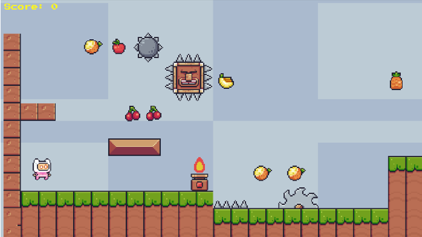

*Af: Michael Hansen, Coding Pirates Furesø, 2022-23, version 1.52*

*Dokument og kode ligger her: <https://github.com/mhfalken/unity/>*

Dette er en guide i hvordan man laver et lille 2D platform spil i Unity,
som vist på billedet. Det inkluderer alt fra en start pakke og til en
fuld gennemgang i hvordan man gør.

Der er ingen specifik C# undervisning, men det meste af den kode som man
skal bruge er vist med eksempler. På min github ligger den fulde
”løsning” som en pakket fil

<https://github.com/mhfalken/unity/blob/main/2dplatform_final.zip>

Der er også en liste af tips, hvis man allerede kender lidt til Unity.

Dokumenter indeholder også i bunden nogle links til gode videoer.

Dokumentet og koden er lavet i Unity version 2020.3. Den burde også
virker i andre versioner, men der kan være små forskelle. (Dokumentet er
opdateret til også at passe til 2021.3).
