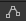

## Frugter


Nu skal vi have nogle ting vi kan ’tage’. Der er en række frugter, som
kan bruges til dette. Frugterne skal også animeres.

1.  Start med at lave en folder under **Assets** som hedder
    **Animator**.

2.  I folderen **Pixel Adventures 1/Assets/Items/Fruits** vælg
    *Cherries* og sæt **Pixels Per Unit** til 16 i **Inspector**’en.
    Tryk derefter **Apply** nede i højre hjørne. Dette skal generelt
    gøres for alle de grafikbilleder som man skal bruge. Jeg har gjort
    det for nogle få af dem, resten må I selv klare. Hvis man ’glemmer’
    det så bliver billederne bare meget små!


3.  Tryk på *Cherries* og træk den ind i **Scenen**. I dialog boksen som
    kommer frem, gem filen i *Animator* folderen og kald den *Cherries*.

4.  Ret navnet i **Hierarchy**’et til *Cherries* (fjern \_0).

Prøv at køre det og se hvordan bærret bevæger sig.

5.  Tilføj en **Box Collider 2D** til *Cherries* og ret størrelsen så
    den passer .

6.  Sæt derefter **Is Trigger**.


En *trigger* kollision betyder at man ikke får en reel kollision, men
kun en trigger på at de to figurer overlapper.

7.  I **Inspector**’en tilføj et **Tag** som hedder *Fruit* og vælg det
    for *Cherries* (**Add Tag**, tryk på ’**+**’ og skriv *Fruit.* Vælg
    derefter *Fruit* for *Cherries*.).


8.  Tilføj følgende linjer i bunder af *PlayerController* scriptet (før
    den sidste ’}’).

```csharp
private void OnTriggerEnter2D(Collider2D collision)
{
    if (collision.gameObject.CompareTag("Fruit"))
    {
        Destroy(collision.gameObject);
    }
}
```

Test og se hvad der sker når *Player* rammer frugten.
