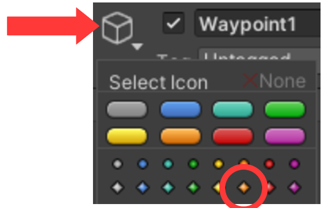

## Bevægelige objekter

Vi vil nu gerne have nogle af vores forhindringer til at bevæge sig.
Scriptet vi skal bruge til det ligger i **Assets/Scripts** og hedder
*WaypointFollower*. Scriptet kan bruges både til at få platforme til at
bevæge sig, men også fjender til at gå i et mønster, dvs. mellem en
liste af punkter.

I det følgende vil vi få rundsaven til at bevæge sig til siderne, dvs.
mellem to punkter.

1.  Lav et tomt objekt og kald det *MovingSaw*. (Husk at sætte
    **Transform-\>Position-\>Z** = 0.)

2.  Tilføj *Saw* (brug Prefab) under *MovingSaw*

3.  Tilføjer scriptet *WaypointFollower* til *Saw*.

4.  I **Inspector**’en for *Saw* laves der det antal Waypoints som man
    har brug for – i det her tilfælde 2. Åben **Waypoints** og tryk på
    ’+’ for at tilføje Waypoints.

5.  Lav et tilsvarende antal *Waypoints* (**Create Empty**) i
    **Hierarchy**’et under *MovingSaw* og de kaldes *Waypoint1*,
    *Waypoint2*, …

6.  *Waypointsne* trækkes over i **Inspector**’en for *Saw* en for en.
    Det skal nu gerne se sådan ud:

7.  Sæt **Speed** til **5** i **Inspector**’en for Saw. Det er den
    hastighed som den skal bevæge sig med og skal trimmes senere når det
    hele kører.

Nu er alt gjort klart, men vi mangler at placere de to *Waypoints* de
rigtige steder.

8.  Vælg *Waypoint1* og i **Inspector**’en tryk på den lille terning i
    øverste venstre hjørne og vælg en af farverne i nederst linje.

Waypointet bliver nu synligt i **Scene** vinduet.

9.  Flyt det hen som det ene endepunkt.

10. Gør det samme for *Waypoint2*, men placer det som det andet
    endepunkt.

Nu skulle det hele gerne virke. Husk at man kan ændre på hastigheden med
**Speed**. Læg mærke til at *Waypoint*’ens ikke er synlige i **Game**
vinduet.

11. Husk at lave en **PreFab**, så er det let at genbruge den.

12. Vælg et andet objekt også og får det til at bevæge sig, fx *Spike
    Head*.

Det kan også være en fordel at have lidt forskellige PreFabs af fx
saven, en for venstre/højre og en for op/ned. Det gør det lettere at
bruge senere når man skal lave flere baner.
