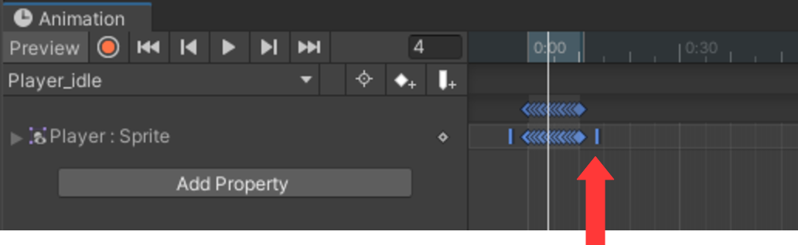

## Player animationer

Nu skal vi have animeret vores
*Player*. Under den grafik folder hvor I har fundet jeres Player (**Main
Characters/**), findes nogle forskellige ”animationer”, dvs. serie af
billeder som vist i den rigtige hastighed laver en animation. Vi skal
starte med at lave en animation når *Player* står stille (idle).

1.  I folderen *Animator*, **Create-\>Animation** og kald filen
    *Player_idle*.

2.  Træk derefter *Player_idle* filen over objekt *Player* i
    **Hierarchy**’et. (Dette laver også en *Player controller* første
    gang man gør det – se billede til højre.)

3.  Så skal man åbne animationsvinduet:
    **Window-\>Animation-\>Animation**.

4.  Vælg derefter *Player* objektet i **Hierarchy**’et.

5.  Vælg nu alle de billeder som udgør animation og træk dem over i
    **Animatoren**. (Det gøres ved at finde den *Idle* animationsfil man
    vil bruge og trykke på den lille pil så man kan se alle billederne,
    vælge alle sammen og trække dem over i animatoren med musen).

Det skal se ud som på billedet neden for.

6.  Man kan nu se hvordan det ser ud ved at trykke på play
     knappen, og justere
    hastigheden ved at flytte den blå streg til siderne (se rød pil
    nedenfor).
    

7.  Da animation skal forsætte, skal man huske at sætte *Loop Time* i
    **Inspector**’en for *Player_idle*.

Når man er færdig med animationsvinduet, kan man med fordel dock’et det
til et af de andre vinduer man har fx **Console** vinduet, så det er
lettere at finde næste gang.

Prøv spillet og se om det virker.
