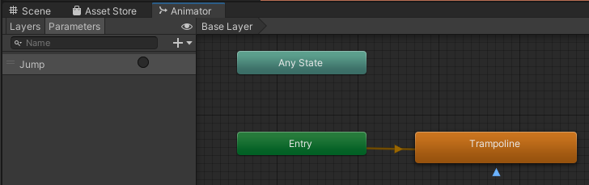

## Trampolin

Her beskrives hvordan man laver en trampolin. Koden er lavet sådan at
for at trampolinen ’virker’ skal man hoppe på den. (Det er en fordel
hvis man har lavet Player animationer først).

1.  Find billedet af *Trampoline* (Jump) og træk den ind i **Scene**n
    som for frugterne og kald den *Trampoline* og gem den i *Animator*
    folderen.

2.  I **Hierarchy**’et rename objektet til Trampoline.

3.  Vælg *Trampoline* objektet i **Hierarchy**’et og tilføj en **Box
    Collider 2D** og tilpas den.

4.  Sæt også **Is Trigger**

5.  Giv den et **Tag** som hedder *Trampoline* (skal laves først).

6.  Åben **Animator** vinduet (Trampoline objektet skal være valgt) og
    tilføj en *trigger* **Parameter** som hedder *Jump*.

7.  Lav en **Make Transition** af *Trampoline* staten til sig selv – se
    blå pil på billedet nede i højre hjørne:



8.  Vælg den nye *Transition* (pilen) og tilføj en **Conditions** og sæt
    den til *Jump*.

9.  Fjern også fluebenet ud for **Has Exit Time**.


10. Vælg *Trampoline* i *Animator* folderen og fjern fluebenet i **Loop
    Time** (**Inspector**’en):


11. Tilføj følgende linjer til *PlayerController* scriptet (i bunden af
    OnTriggerEnter2D(Collider2D collision))

```csharp
if (collision.gameObject.CompareTag("Trampoline"))
{
    Animator animC = collision.gameObject.GetComponent<Animator>();
    float forceY = Mathf.Abs(rb.velocity.y * jumpPower / 8);

    if (forceY > 100)
    {
        if (forceY > 800)
            forceY = 800;

        animC.SetTrigger("Jump");
        rb.velocity = new Vector2(rb.velocity.x, 0);
        rb.AddForce(new Vector2(0, forceY));
    }
}
```

12. Husk at lave en PreFab når det virker.
