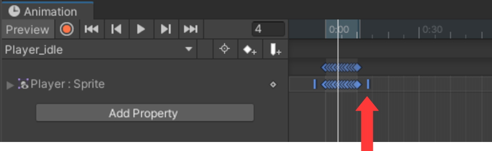

## Animation

Når man skal have sin figur og objekters grafik til at bevæge sig skal
man bruge en Animator. Dette er beskrevet i denne video:
<https://youtu.be/GChUpPnOSkg?list=PLrnPJCHvNZuCVTz6lvhR81nnaf1a-b67U&t=14>

Her er hvordan man laver sin første animation til sin *Player* (kræver
man har set videoen…). Hvis man ikke har en folder som hedder *Animator*
under *Assets*, skal den laves først.

1.  I folderen *Animator*, **Create-\>Animation** og kald filen noget
    ’fornuftigt’, fx *Player_idle*.

2.  Træk derefter *Player_idle* filen til objekt *Player* i
    **Hierarchy**’et. (Dette laver også en *Player controller* første
    gang man gør det.)

3.  Så skal man åbne animationsvinduet:
    **Window-\>Animation-\>Animation**.

4.  Vælg derefter *Player* objektet i **Hierarchy**’et.

5.  Vælg nu alle de billeder som udgør animation og træk dem over i
    **Animatoren**.

6.  Man kan nu se hvordan det ser ud ved at trykke på *play*, og justere
    hastigheden ved at flytte den blå streg til siderne (se billede
    nedenfor).

7.  Hvis animation skal forsætte, skal man huske at sætte *Loop Time* i
    **Inspector**’en.

Når man er færdig med animationsvinduet, kan man med fordel dock’et det
til et af de andre vinduer man har, så det er lettere at finde næste
gang.
