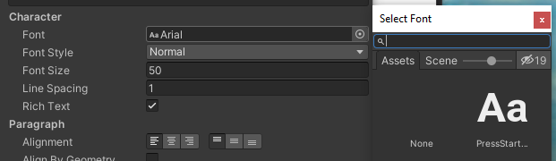

### Fonte

Default har Unity kun én font. Man kan let installere flere fonte og på
den måde få et federe udseende. Font’ene kan bla. findes på den link,
der er nederst i dette dokument.

Opret en folder under **Assets** og kald den **Fonts**. De fonte som man
ønsker at bruge skal så trækkes over i denne folder. Når det er gjort,
kan fonten bruges i tekst objektet ved at trykke på
 ud for **Font**.

