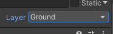

## Draw Level

Draw a small simple level with at least one platform you can jump up on
(it doesn't have to look like mine!). You can always draw more later...

1.  Click on *Terrain* in the **Hierarchy** (under *Grid*) and then on
    **Open Tile Palette** in the **Scene** window.

By selecting the images in the **Tile Palette** window you can draw your
level in the **Scene** window. You can also delete, copy etc. by selecting in
this menu (at the top of the **Tile Palette** window).

2.  Draw a bit on the level. Not too much at this point, as you
    need a Player to find the right dimensions for
    jumping etc.

When you're done drawing, you need to set the **Layer** to *Ground* in the *Terrain* **Inspector**.

3.  First *Ground* must be created, this is done by clicking on the small
    down arrow in the **Inspector** next to **Layer** and selecting **Add Layer** at
    the bottom of the list. Write *Ground* next to **User Layer 3**.

4.  Click on *Terrain* in the **Hierarchy** again and now select *Ground* in
    the **Inspector**.

