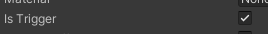

## Fruits


Now we need some items that we can 'collect'. There are a series of fruits that can be used for this. The fruits should also be animated.

1.  Start by creating a folder under **Assets** called
    **Animator**.

2.  In the folder **Pixel Adventures 1/Assets/Items/Fruits** select
    *Cherries* and set **Pixels Per Unit** to 16 in the **Inspector**.
    Then press **Apply** in the bottom right corner. This should generally
    be done for all the graphic images you want to use. I have done
    it for a few of them, the rest you must handle yourself. If you 'forget'
    this, the images will just become very small!


3.  Click on *Cherries* and drag it into the **Scene**. In the dialog box that
    appears, save the file in the *Animator* folder and call it *Cherries*.

4.  Change the name in the **Hierarchy** to *Cherries* (remove \_0).

Try running it and see how the berry moves.

5.  Add a **Box Collider 2D** to *Cherries* and adjust the size so
    it fits .

6.  Then set **Is Trigger**.



A *trigger* collision means you don't get a real collision, but
only a trigger that the two figures overlap.

7.  In the **Inspector** add a **Tag** called *Fruit* and select it
    for *Cherries* (**Add Tag**, click on '**+**' and write *Fruit.* Then select
    *Fruit* for *Cherries*.).


8.  Add the following lines at the bottom of the *PlayerController* script (before
    the last '}').

```csharp
private void OnTriggerEnter2D(Collider2D collision)
{
    if (collision.gameObject.CompareTag("Fruit"))
    {
        Destroy(collision.gameObject);
    }
}
```

Test and see what happens when the *Player* hits the fruit.