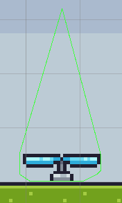

## Fan booster

This describes how to create a fan (blower) that can blow you up into the air.

1.  Find the image of the *Fan* (On) and drag it into the **Scene** as you did for the fruits and call it *Fan* and save it in the *Animator* folder.

2.  In the **Hierarchy** rename the object to *Fan*.

3.  Select the *Fan* object and give it a **Tag** called *Fan* (must be created first).

4.  Add a **Polygon Collider 2D** and make it look like in the image below (the green line). (The height of the triangle is not that important – just something that resembles the image).

5.  Set **Is Trigger**.



6.  Add the following code to the *PlayerController* script (at the bottom of the file before the last '}').

```csharp
private void OnTriggerStay2D(Collider2D collision)
{
    if (collision.gameObject.CompareTag("Fan"))
    {
        float distX = collision.gameObject.transform.position.x - gameObject.transform.position.x;
        if (Mathf.Abs(distX) < 0.5f)
            distX = Mathf.Sign(distX) * 0.5f;

        float distY = Mathf.Abs(collision.gameObject.transform.position.y - gameObject.transform.position.y);
        float forceY = jumpPower / (7 * distY * distY);
        float forceX = -jumpPower / (4 * distX);

        if ((distY < 3) && (rb.velocity.y < 0))
            forceY *= 3;

        if (Mathf.Abs(forceY) > 450)
            forceY = Mathf.Sign(forceY) * 450;

        rb.AddForce(new Vector2(forceX, forceY));
    }
}
```

7.  You also need to add a line to the Update() function (it should be placed right after the transform.Translate call - only the line in **bold** needs to be added):

```csharp
transform.Translate(dir * speed * Time.deltaTime, 0, 0);
```

**rb.velocity = new Vector2(0, rb.velocity.y);**

8.  Remember to create a PreFab when it works.