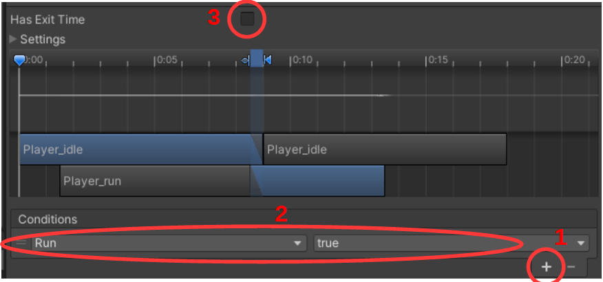

### Run animation (advanced)

Our *Player* needs more than one animation, as he also needs a run animation.

1.  For each additional animation you need, repeat the steps above. Remember to select the correct animation in the **Animation** window before copying the images over.


Since you now have multiple animations, you need to tell Unity which animation to use when.

2.  Open the Player **Animator** – double click on:


An image appears that looks a bit like this:


This is a diagram showing the different animation states and how you can go from one to another.

3.  Create the two vertical arrows by right-clicking on *Player_idle*, select **Make Transition** and drag it to *Player_run*.

4.  Do the same in the opposite direction too, so there are two arrows – one in each direction – see image.

5.  Add a parameter by clicking on '+' at the top left (red circle), select **Bool** and call it *Run*.

6.  Now click on the arrow that goes from *Player_idle*->*Player_run* and look at the **Inspector** on the right.



7.  Press '+' [1], which automatically creates [2]. Remove the checkmark in **Has Exit Time** [3].

8.  Do the same for the other arrow, but this time choose **false** in [2].

It is now set up so that when *Run* is **true**, it switches to the *Player_run* state and when *Run* is **false**, it switches back to *Player_idle*. This way *Run* determines which animation the player has.

Now we need to get our Player script to control this *Run* parameter.

9.  Add the following lines to the *PlayerController* script (in the right places).

```csharp
Animator animator;

...

animator = GetComponent<Animator>();

...

if (dir == 0)
    animator.SetBool("Run", false);
else
    animator.SetBool("Run", true);
```

If *dir* (our movement) is 0 (we're standing still), then we set *Run* to **false** (i.e. don't run), otherwise set *Run* to **true** (run).

Try to see how it works.