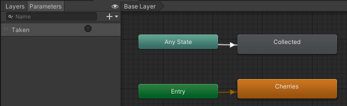
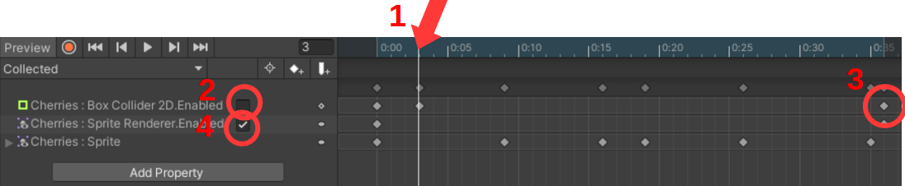

## Collect fruit animation

We need to create an animation when collecting a fruit. (It's an advantage if you've created Player animations first).

Down in the **Assets** folder under **Fruits** there's an animation called *Collected* which should be used when collecting a fruit.

1.  Under the **Animator** folder right-click and **Create->Animation** and call it *Collected*.

2.  Now drag it over one of the fruits in the **Hierarchy**.

3.  Open the **Animator** window and then select this fruit. There's now a new state called *Collected*.

4.  Create an arrow between **Any State** and the **Collected** state.

5.  Create a **Parameter (Trigger)** and call it *Taken* and select it for the arrow in the **Inspector**.



6.  In the **Animation** window select *Collected* and drag the images from the *Collected* file into the **Animation** window and trim the speed so it looks good.

Then we need to add some special states so we can control that you only get points once and that the object becomes disabled after the animation.

7.  Press **Add Property** and then press the arrow next to **Box Collider 2D** and then '+' next to *Enable*.

8.  Do the same for **Sprite Renderer**. See image below.

9.  Then press in the blue area ([1] in the image) and then press [2] so the checkmark disappears (this also creates a small diamond).

10. Then remove the 'diamond' at [3] (right-click **Delete Key**).

11. Now click in the blue area above [3] and remove the checkmark at [4].



12. In the *PlayerController* script now change the OnTriggerEnter2D to the following:

```csharp
Animator animC = collision.gameObject.GetComponent<Animator>();
animC.SetTrigger("Taken");
//Destroy(collision.gameObject);
```

Now it should work.

It's important to do this for all fruits, but it's much easier now, as you only need to do a couple of the steps.

1.  (2) From the **Assets/Animator** folder drag *Collected* over the fruit in the **Hierarchy**.

2.  (4-5) Select the fruit and in the **Animator** window, create the arrow, create the parameter *Taken* and select it for the arrow.

3.  This is done for all fruits.

The same method can be used to create an animation when the *Player* dies. There are some special graphics images for this under the *Main Characters* folder.