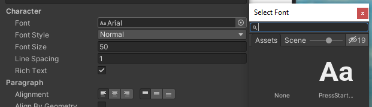

### Fonts

By default, Unity only has one font. You can easily install more fonts and
get a cooler look that way. The fonts can be found, among other places, at the link
at the bottom of this document.

Create a folder under **Assets** and call it **Fonts**. The fonts you
want to use should then be dragged into this folder. When this is done,
the font can be used in the text object by clicking on
 next to **Font**.

