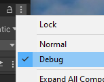

## Debugging

When you need to debug your C# scripts, you can advantageously add some
print statements to the code to see how different values change.
You can add debug text in the following way, which can be seen in the
**Console** when the program runs.

Debug.Log("Text " + value);

You can also click on the three dots in the right corner of the **Inspector** GUI
and select Debug. This way you can see all variables in the program
while it's running in the **Inspector** under **Script**.