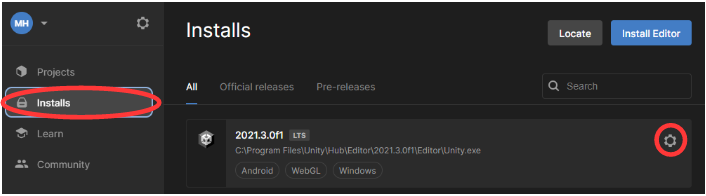
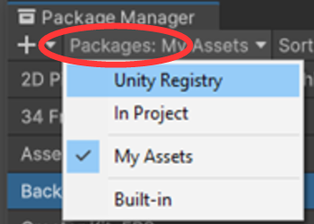
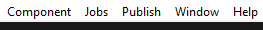

## WEB release

You can get your game released on the web, so it can be played from a
browser without installation. That way others can try your game.

1.  Open Unity HUB and click on **Installs** and then on
    .

2.  Select *Add modules*

3.  Select *WebGL Build Support*.

4.  Click **Install** and wait for the installation to complete.

5.  If Unity GUI is open it must be restarted after the installation

In Unity GUI: **Window->Package Manager**.

Click on **Packages** and select **Unity Registry**.

In the search field on the right, enter *webgl* and click **Install** in the bottom right corner.

When the installation is complete, a new menu item has appeared at the
top of the screen next to **Window** called **Publish**.

1.  Click on **Publish->WebGL Project**.

2.  Select **Build and Publish** and then **Switch to WebGL**.

3.  Click on **Select Folder** (without selecting anything).

Now the entire project needs to be compiled and uploaded to the web. This takes
some time. When it's done, it opens a window in the browser. Here
you can enter a name for the game and add an icon. Remember to click
**Save**. Now the game can be played by clicking **Play**. The link to
the game is in the address field at the top of the browser (as usual).

If you make changes to your game, you only need to repeat the process
from clicking on **Publish**.