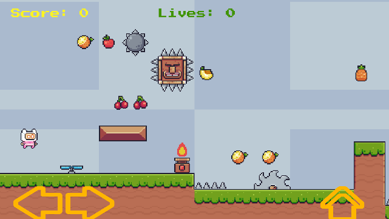

## Android support (advanced)

Here is a general (brief) description of how you can get the game
to run on an Android device (phone or tablet). **This will require
that you fight with it a bit yourself to get it working**!

An Android device has no buttons, so the first step is to create
some buttons on the screen, so you have something to press.



There is a Unity package that contains these buttons and the logic
needed to read them here:

<https://github.com/mhfalken/unity/blob/main/android-knapper.unitypackage>

Start by importing this package.

The buttons must 'lie' under *Canvas* in the **Hierarchy**, but before they
can do that, it needs to be changed a bit.

For *Canvas* you need to correct the following in the **Inspector**:

1.  **Render Mode**: Screen Space – Camera

2.  **Render Camera**: Drag *Main Camera* into this field.

3.  **Plane Distance**: 0


Now the current texts (Score etc.) will most likely become
'invisible'. This must be fixed by messing with the **Pos Z** values for
the texts in the **Inspector**.

Remember they must be visible in both **Scene** view and **Game** view to
work! Test that everything works as before.

Before continuing, it's important that the following option is set, as
described earlier (if not, there's a bit of extra work here...).


Under *PreFabs* find *Knapper* and drag it up over *Canvas* in
the **Hierarchy**, so it looks like this:


Now some buttons should appear. If they are not visible in
**Game** view, then **Pos Z** needs to be fixed. It should now look like the
above image of the game with the buttons.

We now need to add some lines to our *PlayerController*
script. The lines are 'wrapped' in compiler options, so they are only
active when you are in Android mode. Where the individual lines should go
depends a bit on how the code already looks, so it may well be that
the guide doesn't fit perfectly with your code!

At the very top of the file (line 1) should be the following (it's to
make it easier to test and debug):

```csharp
#if UNITY_ANDROID

#define SCREEN_BUTTONS

#endif
```

Under 'global' variables should be:

```csharp
#if SCREEN_BUTTONS

Knapper knapperObj;

#endif
```

In Start() should be (it doesn't matter where):

```csharp
#if SCREEN_BUTTONS

Debug.Log("SCREEN_BUTTONS");

knapperObj = GameObject.Find("Knapper").GetComponent<Knapper>();

#else

GameObject.Find("Knapper").SetActive(false);

#endif
```

These lines should be in Update() immediately after you have <u>read</u>
*dir* and *jump* with Input.GetAxisraw().
```csharp
#if SCREEN_BUTTONS

dir = knapperObj.GetDirX();

jump = knapperObj.GetJump();

#endif
```

To test if it works, you should put the following line in line 4
(it forces the code to activate the buttons even if you are not in
Android mode):
```csharp
#define SCREEN_BUTTONS
```

Run the game and click with the mouse on the buttons and see that they work (the keys
don't work in Android mode). When it works, delete the #define
SCREEN_BUTTONS line again.

When you are not in Android mode (or debug) the buttons
disappear automatically when you run the game. Try and see that they are gone now when the game
runs and that it otherwise works normally.